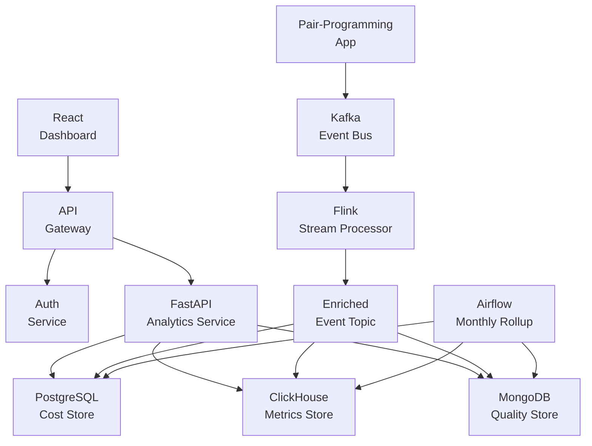
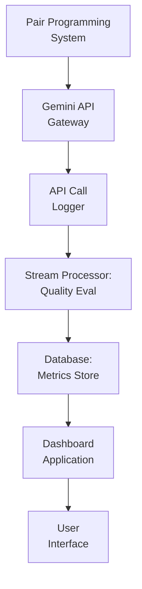

# Meeting Archive: meeting-1775369841462-8kni0syi
**Date:** April 05, 2026 at 11:47 AM

---

### user
🎧 **[Live System Audio]:**  Okay, similar use case, basically, so pair program. for example system, but we want to evaluate the responses of Jim. if they are good or not. Basically whenever you are asking questions to Jivini. right? So we are having a dashboard. which at the month level captures all the statistics, how accurate. were Gemini responses, what was the cost for Gemini response? how many times user have actually requested Gemini API? So to build this what would be your How will you design this system and what will be your considerations.

### user
Full Interview Analysis

### assistant
### 1. The Core Question  
Design a system that tracks and evaluates Gemini API responses for accuracy, cost, and usage, presenting monthly statistics on a dashboard.

### 2. 5-Second Cheat Sheet  
- Event‑driven ingestion of API call logs  
- Metrics aggregation & cost calculation  
- Accuracy scoring & dashboard visualization  

### 3. Architect Follow‑Ups  
1. What is the expected volume of Gemini API calls per month, and what latency is acceptable for metric ingestion?  
2. How will you define “accuracy” for Gemini responses, and what data sources or human annotations will be used to compute it?  

### 4. Interview Category  
[SYSTEM DESIGN]

### user
🎧 **[Live System Audio]:**  Repeat the question. So, question is basically you want to analyze the system. that you have already built, right? So this neuron code AFI programming agent. So what your manager has suggested is, why not have it? dashboard which is a monthly dashboard basically for every month you will capture. how many times Gemini API was called what was the cost of that And what was the quality of responses whenever you called Gemini in the PAIR programming system, how the response is full there. actually are the good responses or users are satisfied with or not so if you want to do this analysis. So at the end of the day, through a dashboard. So how? How would you build this dashboard and, for example, if you're building a... sub-application, right? So what would be your HLD for it? How would you design this application.

### user
Full Interview Analysis

### assistant
### 1. The Core Question  
Design a monthly dashboard that tracks Gemini API call counts, cost, and response quality for a pair‑programming system.

### 2. 5-Second Cheat Sheet  
- Event‑driven ingestion of API logs  
- Cost aggregation & accuracy scoring  
- Time‑series visualization on a dashboard  

### 3. Architect Follow‑Ups  
1. What volume of Gemini calls per month do you anticipate, and what latency is acceptable for metric ingestion?  
2. How will “response quality” be quantified—human annotations, automated metrics, or user feedback?  

### 4. Interview Category  
[SYSTEM DESIGN]

### user
System Design

### assistant
### 1. High-Level Architecture (Spoken overview)  
I’d start by treating the dashboard as a separate analytics sub‑application that consumes immutable events from the pair‑programming service. Every time the front‑end invokes the Gemini API I’ll emit a lightweight event that contains the request ID, timestamp, user ID, model name, token usage and the raw response. Those events flow into a durable message bus, get enriched in a stream processor where we calculate the monetary cost from token counts and run a quick quality heuristic – for example a similarity score against a reference answer or a sentiment check on the user’s thumbs‑up/down feedback. The enriched records are then persisted into purpose‑built stores: a columnar warehouse for high‑speed aggregations, a relational DB for cost‑center mapping, and a document store for any free‑form quality annotations. A scheduled job rolls up the raw daily data into monthly aggregates, and the front‑end React app pulls those aggregates through a thin FastAPI layer that also enforces auth. The whole thing lives behind an API gateway so we can evolve the services independently.

### 2. Architecture Diagram  

### 3. End-to-End Data Flow (Conversational walkthrough)  
When a developer clicks “Ask Gemini” the pair‑programming front‑end calls the Gemini endpoint and simultaneously publishes an event to Kafka. That event carries the raw request and response payloads plus token usage. The Flink job consumes the event, looks up the current pricing tier, multiplies tokens by price to compute cost, and runs a lightweight quality model – perhaps a cosine similarity against a cached reference answer or a simple sentiment analysis on any explicit user rating. The enriched record is written back to a second Kafka topic and then persisted into three downstream stores: ClickHouse for fast time‑series queries on call volume and cost, PostgreSQL for mapping costs to billing accounts, and MongoDB for storing any free‑form quality comments or scores. Every night an Airflow DAG reads the day‑level tables, aggregates them into month‑level summaries, and writes the results back into ClickHouse and PostgreSQL. The React dashboard calls the FastAPI analytics layer, which fetches the pre‑computed monthly aggregates and returns JSON ready for charting.

### 4. Database Strategy (Spoken justification)  
For raw, high‑cardinality metrics like per‑call token counts and cost I prefer a columnar store such as ClickHouse because it can scan billions of rows with sub‑second latency and supports roll‑up functions out of the box. Billing‑related dimensions – user, team, cost center – live nicely in PostgreSQL where we can enforce referential integrity and run ad‑hoc joins. The quality feedback is inherently semi‑structured; developers may leave free‑text comments, attach screenshots, or rate responses on a Likert scale, so a document database like MongoDB gives us schema flexibility without sacrificing query performance for the occasional filter by rating. This tri‑store approach lets each workload use the engine that matches its access pattern.

### 5. Scalability & Bottlenecks  
The biggest ingestion pressure comes from the Kafka topic; we’ll partition by request ID to spread load across brokers and set appropriate retention so downstream consumers can replay if needed. Flink scales horizontally by adding task slots, and because the enrichment logic is stateless it can handle spikes without back‑pressure. ClickHouse’s merge‑tree architecture handles the write‑heavy ingest and the read‑heavy aggregation simultaneously, but we must monitor disk I/O and configure appropriate compaction intervals. PostgreSQL could become a bottleneck for billing joins; we can mitigate that by sharding on tenant ID or using read replicas for dashboard queries. Finally, the FastAPI layer should sit behind an auto‑scaling group behind the API gateway, ensuring that sudden bursts of dashboard traffic don’t overwhelm the service.

### user
System Design

### assistant
### 1. High-Level Architecture (Spoken overview)
I would start by designing a dashboard that captures key metrics from the Gemini API, specifically the number of times it's called, the cost associated with those calls, and the quality of the responses. To achieve this, I'd build a sub-application that integrates with the existing pair-programming system. The high-level architecture would involve creating a data pipeline that collects API call logs, processes them to extract relevant information, and then stores this data in a database for later analysis. The dashboard would then query this database to display the desired metrics on a monthly basis.

### 2. Architecture Diagram

### 3. End-to-End Data Flow (Conversational walkthrough)
The process begins when a user interacts with the pair-programming system, triggering a call to the Gemini API. Each API call is logged and sent to a stream processor for real-time analysis. The stream processor evaluates the quality of the response and calculates the cost based on the API's pricing model. This processed data is then stored in a database designed for efficient querying and analysis. On a monthly basis, the dashboard application queries this database to aggregate the metrics—call count, total cost, and average response quality—and displays them in a user-friendly format.

### 4. Database Strategy (Spoken justification)
For the database, I chose a combination of a relational database for storing structured data like user information and API call metadata, and a NoSQL database for handling the semi-structured data from the API responses. This approach allows for flexible schema design and efficient data retrieval. The relational database, such as PostgreSQL, is ideal for storing and querying structured data, while a document-oriented database like MongoDB can handle the variability in API response formats and any additional metadata.

### 5. Scalability & Bottlenecks
To ensure scalability, each component of the system is designed to handle increased traffic independently. The API call logger and stream processor are built to scale horizontally, adding more instances as needed to handle higher volumes of API calls. The database is optimized for high-performance querying and can be sharded or replicated to distribute the load. Potential bottlenecks include the stream processor if the quality evaluation becomes too complex, and the database if the query load exceeds its capacity. Monitoring these components and scaling them as necessary will prevent bottlenecks and ensure the system can handle growing demands.

### user
🎧 **[Live System Audio]:**  Yes, sorry to interrupt. You're slightly diverging from this question. question is more about the design of the dashboard at the end of today we want to see these details. So if you talk about individual parts of it. So, one part we might think is how you are going to know whether it is... response from LLM is actually satisfactory to that user or not. So maybe let's think from that point.

