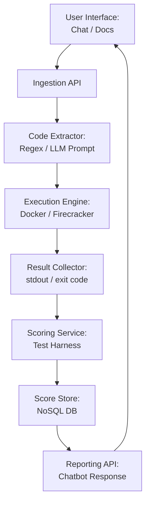

# Meeting Archive: meeting-1775381978593-yzzpcb5z
**Date:** April 05, 2026 at 03:10 PM

---

### user
🎧 **[Live System Audio]:**  So assume there is a use case, okay, similar use case. Basically, so pair programming, for example, system. But we want to evaluate the responses of Gemini if they are good or not. Basically, whenever you are asking questions to Gemini, right? We are having a dashboard which at the month level capital. all the statistics. How accurate were Gemini responses? What was the cost for Gemini responses? How many times users have access? actually requested JMNA API. So to. build this. What would be your HLD? How will you design this? system and what will be your considerations.

### user
Full Interview Analysis

### assistant
### 1. Intent Evaluation  
The interviewer is asking for a high‑level system design to capture, store, and analyze Gemini API usage metrics (accuracy, cost, request counts) and present them in a monthly dashboard.

### 2. Interview Category  
[SYSTEM DESIGN]

### 3. The Overarching Goal  
Build a system that collects Gemini API usage data, evaluates response quality and cost, and displays monthly metrics on a dashboard.

### 4. The Current Question (Pivot)  
What would be your high‑level design and key considerations for building this Gemini evaluation dashboard?

### 5. 5‑Second Cheat Sheet  
- **Data ingestion**: Capture request/response logs via a middleware layer or webhook, store in a scalable time‑series or event store.  
- **Metric computation**: Compute accuracy against ground‑truth, aggregate cost from API billing, count requests per user.  
- **Dashboard**: Use a BI tool (e.g., Grafana, Looker) or a custom React/Streamlit app to visualize monthly KPIs.

### 6. Architect Follow‑Ups  
1. What is the expected request volume per month and peak concurrency?  
2. How will you obtain or define ground‑truth data to calculate accuracy for Gemini responses?

### user
🎧 **[Live System Audio]:**  how you are going to know whether a response from LLM is actually satisfying. factory to that user or not. So maybe let's think from that point. We'll see you in a minute. Look at...

### user
Full Interview Analysis

### assistant
### 1. Intent Evaluation  
The interviewer is focusing on how to measure whether an LLM response actually satisfies the user.  
The true intent is to design a measurement strategy, not a system architecture.

### 2. Interview Category  
[STRATEGY]

### 3. The Overarching Goal  
Define a method to evaluate user satisfaction with Gemini LLM responses.

### 4. The Current Question (Pivot)  
How can we determine if a Gemini response is satisfying the user?

### 5. 5-Second Cheat Sheet  
- Collect explicit user feedback (thumbs‑up/down, star rating, short comment).  
- Track implicit signals (time to next user action, number of follow‑up questions).  
- Compare the response to a ground‑truth or reference answer when available.

### 6. Architect Follow-Ups  
1. What types of user feedback mechanisms are currently available or planned?  
2. Do you have a repository of reference answers or a way to generate them for comparison?

### user
🎧 **[Live System Audio]:** So how would you rate yourself in? by them currently out of 10. And I can read myself eight, seven or eight wishes. So just we will talk through a small problem, okay, that we generally... face. So LLM generates a lot of fix right? Yes. So sometimes you might need to analyze these text chunks with different metrics. So let's take simple case of it. So we have array, okay, area of maybe 1 million strings. Each string is maybe 10 to 30 characters long. Okay, so we need to write an efficient code. in python to find a string or substrate. in each of these strings. For example, one string could be Google, right? For example, one of the strings in the area could be Google. If someone asked... is O-O-G, which is part of Google, if present in this area or not. So you need to find where it is if it's not present, you'll just say it's not available. So, hopefully you got For the question, we have a list of strings, basically. and our goal is to search substrings in those strings, or even entire... strings as well. So you can share your screen open.

### user
Full Interview Analysis

### assistant
### 1. Intent Evaluation  
The interviewer is asking for an efficient algorithm to search for a substring within a large list of strings.  
They want a concrete Python implementation, not a system‑level design.

### 2. Interview Category  
[CODING]

### 3. The Overarching Goal  
Write efficient Python code that, given a list of ~1 million short strings, finds the first string containing a specified substring and returns its index or reports “not available”.

### 4. The Current Question (Pivot)  
“How can we efficiently search for a substring in a list of 1 million strings and return its index or indicate it’s missing?”

### 5. 5-Second Cheat Sheet  
- Use a simple loop with `if substring in string` and `enumerate` to get the index.  
- Break immediately on the first match to avoid scanning the entire list.  
- If many queries are expected, build a reverse index (e.g., a dictionary of substrings to indices) or a suffix tree for sub‑linear lookups.

### 6. Architect Follow-Ups  
1. Will the search be performed once per query or many times on the same dataset?  
2. Is the list of strings static, or will it change over time (requiring incremental updates to an index)?

### user
🎧 **[Live System Audio]:**  Maybe share your screen again if you have, for example, Google Docs or some kind of document open those are do you know broader type of can you use it, which is actually where you can create some kind of vector-based flow charts. You can use XLE draw for the... Yeah, XLE is also fine. Any meet... is fine. So if you can share your screen again, just will walk through or you know both of us together let's walk through some application. is an okay some interesting. Yeah. So application. to actually extract whenever the user is sharing the code. For example, you're sharing your code in the previous window, right? So it needs to create that code and actually execute that code and give me details, basically saying that Karthik, out of two interviews, questions you have asked. This person was able to solve one of out of two out of two questions because it has actually run it and checked it. Okay, so the requirement is it needs to run it. Okay, without running, as an LLM, it can't directly just say it's correct. code or not, it needs to run somewhere. So if that is my requirement. So, how would you go about it? Maybe let's... start from the initial point, right? So what would be the technology? you're going to use and what would be the issues you might face.

### user
Full Interview Analysis

### assistant
### 1. Intent Evaluation  
The interviewer is asking how to build a system that can extract code snippets from user input, execute them safely, and determine whether the code solves the interview questions.

### 2. Interview Category  
[SYSTEM DESIGN]

### 3. The Overarching Goal  
Design an application that parses shared code, runs it in a secure sandbox, and reports whether the solution passes the interview’s test cases.

### 4. The Current Question (Pivot)  
“What technology would you use to execute extracted code and what issues might you face?”

### 5. 5-Second Cheat Sheet  
- Use a sandboxed runtime (Docker, Firecracker, or serverless functions) to isolate execution.  
- Parse code from the chat with regex or a language‑model prompt, then feed it to the sandbox.  
- Capture stdout, exit status, and execution time; compare against expected outputs or unit tests to determine correctness.

### 6. Architect Follow‑Ups  
1. Which programming languages and runtime versions must the system support?  
2. How will you obtain or generate the expected outputs/test cases for each interview question?

### user
System Design

### assistant
### 1. High‑Level Architecture (Spoken overview)  
I would start by treating the whole solution as a three‑tier pipeline: **Ingestion**, **Processing**, and **Reporting**. The user types or pastes code into a chat or a shared document, our system captures that snippet, sends it to a sandboxed execution engine, and then feeds the result back into the conversation. The ingestion layer is a lightweight API that receives raw text, runs a quick NLP pass to pull out code blocks, and forwards them to the processing tier. The processing tier spins up a container or serverless function that runs the code in isolation, collects stdout, exit status, and any test harness results. Finally, the reporting tier formats the outcome into a friendly message and updates the user’s interview scorecard. All of this happens behind the scenes, so the interviewer sees a seamless “code‑runs‑and‑scores” experience.

### 2. Architecture Diagram  

### 3. End‑to‑End Data Flow (Conversational walkthrough)  
When the user pastes code, the Ingestion API receives the payload and immediately runs a lightweight extractor that pulls out any fenced code blocks. I then push that snippet to the Execution Engine, which spins up a fresh container with the appropriate runtime (Python, JavaScript, etc.) and runs the code. The container streams back stdout, any exceptions, and a special exit code that tells us whether the code compiled and ran. The Result Collector captures that stream and hands it to the Scoring Service, which runs a set of predefined unit tests or compares the output against expected answers. The Scoring Service writes a simple record—question ID, pass/fail, runtime, and any error messages—to the Score Store. Finally, the Reporting API pulls that record, formats a concise message (“You solved 1 of 2 questions”), and injects it back into the chat so the interviewer can see the result instantly.

### 4. Database Strategy (Spoken justification)  
I’d use a NoSQL document store for the Score Store because each interview session is a self‑contained JSON blob: user ID, timestamp, list of questions, and per‑question results. This schema is flexible enough to accommodate new question types or additional metrics (e.g., memory usage) without schema migrations. For audit and replay, I’d keep a small relational table that logs every execution request with a unique ID, so we can trace back to the exact code snippet and container logs if needed. The relational layer also helps enforce referential integrity between users, sessions, and questions.

### 5. Scalability & Bottlenecks  
The biggest scaling concern is the Execution Engine. Each code run is isolated, so I’d run it in a serverless container platform that can burst to thousands of concurrent executions. The container image is tiny and pre‑loaded with the runtimes we support, so cold starts are minimal. The Ingestion API is stateless and can be behind a load balancer, so horizontal scaling is trivial. The bottleneck could be the test harness if it’s heavy; I’d cache test results for identical code snippets and use a distributed queue to throttle execution requests. Finally, the Score Store should be provisioned for high write throughput, but reads are low‑volume (only when the interviewer asks for a summary), so a read‑optimized NoSQL cluster is sufficient.

### user
Full Interview Analysis

### assistant
### 1. Intent Evaluation
The interviewer is focusing on designing a platform that can reliably extract code snippets from user input, execute them in a secure sandbox, and determine correctness by running test cases.

### 2. Interview Category
[SYSTEM DESIGN]

### 3. The Overarching Goal
Design an end‑to‑end system that parses, safely runs, and evaluates user‑submitted code during an interview.

### 4. The Current Question (Pivot)
What technologies would you choose to build this system and what key challenges must you address?

### 5. 5-Second Cheat Sheet
- Sandbox execution: Docker, Firecracker, or serverless containers with strict resource limits.  
- Code extraction: regex + LLM prompt to isolate fenced code blocks, then push to a message queue.  
- Validation: attach language‑specific test harnesses, compare stdout/exit code to expected results, and report pass/fail.

### 6. Architect Follow-Ups
1. Which programming languages and runtime versions need to be supported out of the box?  
2. How will the system obtain or generate the reference test cases for each interview question?

### user
🎧 **[Live System Audio]:**  So, assume there is a use case, okay, similar use case. basically, so pair programming, for example, system. but we want to evaluate the responses of Gemini if they are good or not. Basically, whenever you are asking questions to Jim and I, right, so... We are having a dashboard, which at the month. level captures all the statistics. How accurate were Gemini response? What was the cost for Gemini responses? How many times you have actually requested Gemini API. So. to build this what would be your HLD how will you design the system and what will be your considerations.

