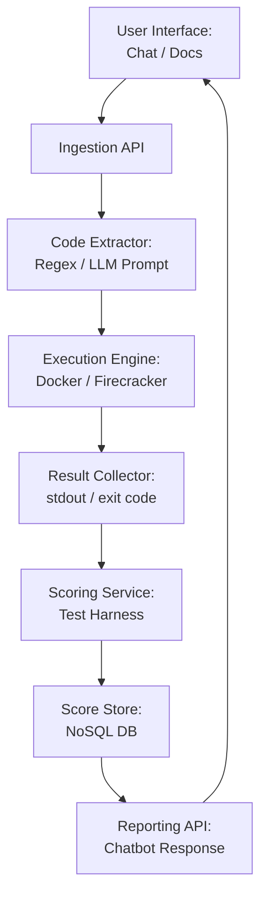
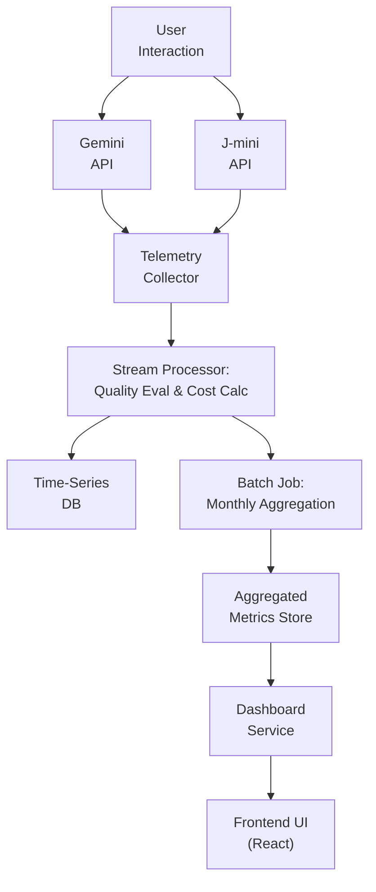

# Meeting Archive: meeting-1775383729877-lpqsq8a7
**Date:** April 05, 2026 at 03:39 PM

---

### user
🎧 **[Live System Audio]:**  So assume there is a use case, okay, similar use case. Basically, so pair programming, for example, system. But we want to evaluate the responses of Gemini if they are good or not. Basically, whenever you are asking questions to Gemini, right? We are having a dashboard which at the month level capital. all the statistics. How accurate were Gemini responses? What was the cost for Gemini responses? How many times users have access? actually requested JMNA API. So to. build this. What would be your HLD? How will you design this? system and what will be your considerations.

### user
Full Interview Analysis

### assistant
### 1. Intent Evaluation  
The interviewer is asking for a high‑level system design to capture, store, and analyze Gemini API usage metrics (accuracy, cost, request counts) and present them in a monthly dashboard.

### 2. Interview Category  
[SYSTEM DESIGN]

### 3. The Overarching Goal  
Build a system that collects Gemini API usage data, evaluates response quality and cost, and displays monthly metrics on a dashboard.

### 4. The Current Question (Pivot)  
What would be your high‑level design and key considerations for building this Gemini evaluation dashboard?

### 5. 5‑Second Cheat Sheet  
- **Data ingestion**: Capture request/response logs via a middleware layer or webhook, store in a scalable time‑series or event store.  
- **Metric computation**: Compute accuracy against ground‑truth, aggregate cost from API billing, count requests per user.  
- **Dashboard**: Use a BI tool (e.g., Grafana, Looker) or a custom React/Streamlit app to visualize monthly KPIs.

### 6. Architect Follow‑Ups  
1. What is the expected request volume per month and peak concurrency?  
2. How will you obtain or define ground‑truth data to calculate accuracy for Gemini responses?

### user
🎧 **[Live System Audio]:**  how you are going to know whether a response from LLM is actually satisfying. factory to that user or not. So maybe let's think from that point. We'll see you in a minute. Look at...

### user
Full Interview Analysis

### assistant
### 1. Intent Evaluation  
The interviewer is focusing on how to measure whether an LLM response actually satisfies the user.  
The true intent is to design a measurement strategy, not a system architecture.

### 2. Interview Category  
[STRATEGY]

### 3. The Overarching Goal  
Define a method to evaluate user satisfaction with Gemini LLM responses.

### 4. The Current Question (Pivot)  
How can we determine if a Gemini response is satisfying the user?

### 5. 5-Second Cheat Sheet  
- Collect explicit user feedback (thumbs‑up/down, star rating, short comment).  
- Track implicit signals (time to next user action, number of follow‑up questions).  
- Compare the response to a ground‑truth or reference answer when available.

### 6. Architect Follow-Ups  
1. What types of user feedback mechanisms are currently available or planned?  
2. Do you have a repository of reference answers or a way to generate them for comparison?

### user
🎧 **[Live System Audio]:** So how would you rate yourself in? by them currently out of 10. And I can read myself eight, seven or eight wishes. So just we will talk through a small problem, okay, that we generally... face. So LLM generates a lot of fix right? Yes. So sometimes you might need to analyze these text chunks with different metrics. So let's take simple case of it. So we have array, okay, area of maybe 1 million strings. Each string is maybe 10 to 30 characters long. Okay, so we need to write an efficient code. in python to find a string or substrate. in each of these strings. For example, one string could be Google, right? For example, one of the strings in the area could be Google. If someone asked... is O-O-G, which is part of Google, if present in this area or not. So you need to find where it is if it's not present, you'll just say it's not available. So, hopefully you got For the question, we have a list of strings, basically. and our goal is to search substrings in those strings, or even entire... strings as well. So you can share your screen open.

### user
Full Interview Analysis

### assistant
### 1. Intent Evaluation  
The interviewer is asking for an efficient algorithm to search for a substring within a large list of strings.  
They want a concrete Python implementation, not a system‑level design.

### 2. Interview Category  
[CODING]

### 3. The Overarching Goal  
Write efficient Python code that, given a list of ~1 million short strings, finds the first string containing a specified substring and returns its index or reports “not available”.

### 4. The Current Question (Pivot)  
“How can we efficiently search for a substring in a list of 1 million strings and return its index or indicate it’s missing?”

### 5. 5-Second Cheat Sheet  
- Use a simple loop with `if substring in string` and `enumerate` to get the index.  
- Break immediately on the first match to avoid scanning the entire list.  
- If many queries are expected, build a reverse index (e.g., a dictionary of substrings to indices) or a suffix tree for sub‑linear lookups.

### 6. Architect Follow-Ups  
1. Will the search be performed once per query or many times on the same dataset?  
2. Is the list of strings static, or will it change over time (requiring incremental updates to an index)?

### user
🎧 **[Live System Audio]:**  Maybe share your screen again if you have, for example, Google Docs or some kind of document open those are do you know broader type of can you use it, which is actually where you can create some kind of vector-based flow charts. You can use XLE draw for the... Yeah, XLE is also fine. Any meet... is fine. So if you can share your screen again, just will walk through or you know both of us together let's walk through some application. is an okay some interesting. Yeah. So application. to actually extract whenever the user is sharing the code. For example, you're sharing your code in the previous window, right? So it needs to create that code and actually execute that code and give me details, basically saying that Karthik, out of two interviews, questions you have asked. This person was able to solve one of out of two out of two questions because it has actually run it and checked it. Okay, so the requirement is it needs to run it. Okay, without running, as an LLM, it can't directly just say it's correct. code or not, it needs to run somewhere. So if that is my requirement. So, how would you go about it? Maybe let's... start from the initial point, right? So what would be the technology? you're going to use and what would be the issues you might face.

### user
Full Interview Analysis

### assistant
### 1. Intent Evaluation  
The interviewer is asking how to build a system that can extract code snippets from user input, execute them safely, and determine whether the code solves the interview questions.

### 2. Interview Category  
[SYSTEM DESIGN]

### 3. The Overarching Goal  
Design an application that parses shared code, runs it in a secure sandbox, and reports whether the solution passes the interview’s test cases.

### 4. The Current Question (Pivot)  
“What technology would you use to execute extracted code and what issues might you face?”

### 5. 5-Second Cheat Sheet  
- Use a sandboxed runtime (Docker, Firecracker, or serverless functions) to isolate execution.  
- Parse code from the chat with regex or a language‑model prompt, then feed it to the sandbox.  
- Capture stdout, exit status, and execution time; compare against expected outputs or unit tests to determine correctness.

### 6. Architect Follow‑Ups  
1. Which programming languages and runtime versions must the system support?  
2. How will you obtain or generate the expected outputs/test cases for each interview question?

### user
System Design

### assistant
### 1. High‑Level Architecture (Spoken overview)  
I would start by treating the whole solution as a three‑tier pipeline: **Ingestion**, **Processing**, and **Reporting**. The user types or pastes code into a chat or a shared document, our system captures that snippet, sends it to a sandboxed execution engine, and then feeds the result back into the conversation. The ingestion layer is a lightweight API that receives raw text, runs a quick NLP pass to pull out code blocks, and forwards them to the processing tier. The processing tier spins up a container or serverless function that runs the code in isolation, collects stdout, exit status, and any test harness results. Finally, the reporting tier formats the outcome into a friendly message and updates the user’s interview scorecard. All of this happens behind the scenes, so the interviewer sees a seamless “code‑runs‑and‑scores” experience.

### 2. Architecture Diagram  


### 3. End‑to‑End Data Flow (Conversational walkthrough)  
When the user pastes code, the Ingestion API receives the payload and immediately runs a lightweight extractor that pulls out any fenced code blocks. I then push that snippet to the Execution Engine, which spins up a fresh container with the appropriate runtime (Python, JavaScript, etc.) and runs the code. The container streams back stdout, any exceptions, and a special exit code that tells us whether the code compiled and ran. The Result Collector captures that stream and hands it to the Scoring Service, which runs a set of predefined unit tests or compares the output against expected answers. The Scoring Service writes a simple record—question ID, pass/fail, runtime, and any error messages—to the Score Store. Finally, the Reporting API pulls that record, formats a concise message (“You solved 1 of 2 questions”), and injects it back into the chat so the interviewer can see the result instantly.

### 4. Database Strategy (Spoken justification)  
I’d use a NoSQL document store for the Score Store because each interview session is a self‑contained JSON blob: user ID, timestamp, list of questions, and per‑question results. This schema is flexible enough to accommodate new question types or additional metrics (e.g., memory usage) without schema migrations. For audit and replay, I’d keep a small relational table that logs every execution request with a unique ID, so we can trace back to the exact code snippet and container logs if needed. The relational layer also helps enforce referential integrity between users, sessions, and questions.

### 5. Scalability & Bottlenecks  
The biggest scaling concern is the Execution Engine. Each code run is isolated, so I’d run it in a serverless container platform that can burst to thousands of concurrent executions. The container image is tiny and pre‑loaded with the runtimes we support, so cold starts are minimal. The Ingestion API is stateless and can be behind a load balancer, so horizontal scaling is trivial. The bottleneck could be the test harness if it’s heavy; I’d cache test results for identical code snippets and use a distributed queue to throttle execution requests. Finally, the Score Store should be provisioned for high write throughput, but reads are low‑volume (only when the interviewer asks for a summary), so a read‑optimized NoSQL cluster is sufficient.

### user
Full Interview Analysis

### assistant
### 1. Intent Evaluation
The interviewer is focusing on designing a platform that can reliably extract code snippets from user input, execute them in a secure sandbox, and determine correctness by running test cases.

### 2. Interview Category
[SYSTEM DESIGN]

### 3. The Overarching Goal
Design an end‑to‑end system that parses, safely runs, and evaluates user‑submitted code during an interview.

### 4. The Current Question (Pivot)
What technologies would you choose to build this system and what key challenges must you address?

### 5. 5-Second Cheat Sheet
- Sandbox execution: Docker, Firecracker, or serverless containers with strict resource limits.  
- Code extraction: regex + LLM prompt to isolate fenced code blocks, then push to a message queue.  
- Validation: attach language‑specific test harnesses, compare stdout/exit code to expected results, and report pass/fail.

### 6. Architect Follow-Ups
1. Which programming languages and runtime versions need to be supported out of the box?  
2. How will the system obtain or generate the reference test cases for each interview question?

### user
🎧 **[Live System Audio]:**  So, assume there is a use case, okay, similar use case. basically, so pair programming, for example, system. but we want to evaluate the responses of Gemini if they are good or not. Basically, whenever you are asking questions to Jim and I, right, so... We are having a dashboard, which at the month. level captures all the statistics. How accurate were Gemini response? What was the cost for Gemini responses? How many times you have actually requested Gemini API. So. to build this what would be your HLD how will you design the system and what will be your considerations.

### user
Full Interview Analysis

### assistant
### 1. Intent Evaluation  
The interviewer is asking how to design a system that captures and reports metrics (accuracy, cost, request count) for Gemini API usage in a pair‑programming context.

### 2. The Overarching Goal  
Build a high‑level architecture that collects, stores, and visualizes monthly Gemini API usage statistics.

### 3. The Current Pivot & Cheat Sheet  
**They want a high‑level design for a dashboard that tracks Gemini’s accuracy, cost, and request volume.**  
- I’ll outline a data pipeline: ingestion → processing → storage → analytics → dashboard.  
- I’ll highlight key metrics: request count, average latency, cost per request, accuracy (e.g., manual review or automated scoring).  
- I’ll note cost‑optimization: batch billing, caching, and selective logging to keep storage lean.

### 4. Architect Follow‑Ups  
1. How will you define “accuracy” for Gemini responses—manual review, automated unit tests, or a confidence score?  
2. Do you need real‑time alerts or only monthly aggregated reports, and what volume of requests are you expecting per month?

### 5. Interview Category  
[STRATEGY]

### user
🎧 **[Live System Audio]:**  So Aranya, sorry to interrupt, you are slightly diverging from this. Question is more about the design of the dashboard. At the end of the day, we want to see these details. So if you talk about individual part. of it. So one part we might think is how you are going to know. whether a response from LLM is actually satisfactory to that user or. or not. So maybe let's think from that point.

### user
Full Interview Analysis

### assistant
### 1. Intent Evaluation  
The interviewer is not asking for a generic dashboard design; they want to know **how to determine if an LLM response is actually satisfactory to the user** so that this assessment can be displayed in the dashboard.

### 2. The Overarching Goal  
Define a method to measure user satisfaction with Gemini’s responses and surface that metric in a monthly dashboard.

### 3. The Current Pivot & Cheat Sheet  
**They want to know how to determine if an LLM response is satisfactory to the user.**  
- I’d start by defining a satisfaction metric—user ratings, thumbs‑up/down, or an automated confidence score.  
- Then I’d capture that signal in real time (or post‑session) and store it alongside the request metadata.  
- Finally, I’d aggregate the data monthly and display pass/fail or average satisfaction in the dashboard.

### 4. Architect Follow‑Ups  
1. What user feedback channel do you plan to use—explicit ratings, implicit engagement signals, or automated NLP‑based sentiment?  
2. Do you need real‑time satisfaction detection for live alerts, or is a batch evaluation after each interview sufficient?

### 5. Interview Category  
[STRATEGY]

### user
Strategy & Metrics

### assistant
### 1. Core Strategy (Spoken approach to the problem)  
I would start by treating the satisfaction signal as just another piece of telemetry that we collect at the moment the user interacts with Gemini. The simplest way is to surface an explicit feedback widget—thumbs up/down or a 1‑5 star rating—right after each response. That interaction gets logged together with the request ID, the prompt, the model version, latency, and cost. On the backend we funnel those events into a streaming pipeline, enrich them with session context, and write them to a time‑series store. The dashboard then aggregates by month, breaking down satisfaction by model, feature flag, or user segment. If we want to go beyond explicit clicks, we also capture implicit signals like whether the user edited the response, asked a follow‑up, or abandoned the session, and feed those into a scoring model that produces a “satisfaction confidence” that we can display alongside the explicit rating.

### 2. Edge Cases & Risks (Conversational walkthrough of pitfalls)  
One tricky scenario is when a user never provides explicit feedback—maybe they’re in a hurry or the UI is hidden. In that case we have to rely on implicit cues, but those can be noisy; a quick follow‑up could mean the answer was partially correct, not necessarily bad. Another risk is feedback bias: users might be more generous early in a session and harsher later, skewing the monthly average. We also need to guard against accidental double‑clicks or bots inflating the counts, so rate‑limiting and deduplication become important. Finally, if we start weighting cost or latency against satisfaction, we have to be careful not to penalize longer, more thoughtful answers that happen to cost a bit more.

### 3. Explicit Metrics (Spoken definitions of what to track)  
The primary explicit metric I’d track is the average rating per response, calculated as the sum of all star or thumbs‑up values divided by the number of rated interactions in the month. I’d also surface the rating distribution so we can see the tail of very low or very high scores. A second explicit metric is the “rating response rate”—the percentage of total Gemini calls that actually received a user rating. That tells us how representative our data is. Finally, I’d capture the cost per rated interaction, so we can correlate satisfaction with spend and spot any inefficiencies.

### 4. Implicit Metrics (Behavioral proxies explained naturally)  
Beyond the clicks, I’d look at how often a user edits the generated code or asks a clarifying question within a short window; a high edit‑or‑follow‑up rate often signals that the original answer missed the mark. Session length is another proxy—if a user stays engaged for many turns after a response, that usually indicates usefulness. Conversely, a sudden drop in activity or an immediate session termination can be a negative signal. I’d also monitor token usage patterns: unusually high token consumption after a response might mean the model had to elaborate because the first answer was insufficient. All these implicit signals would be fed into a lightweight machine‑learning model that outputs a satisfaction confidence score, which we can surface on the dashboard as an “estimated satisfaction” alongside the explicit ratings.

### user
🎧 **[Live System Audio]:**  So let's go into somewhat core AI, okay? So, you have certain basics and statistics. and you have covered ML models as well and you also have idea on generative. Is my understanding correct or is there some deviation from me? this. I have learned about like basic soft. with the DBs and the apply day I signed. not the core, am I? what will be my vector. Okay, and I warm planning to Okay, so let's move towards the rack then. Okay. So I have a rag system. Okay. and I want planning to kind of decide on what would be my vector day. database. So, if you are the AI engineer. in this case and manager asks you what will be your options for vector databases for this application and what will be be the criteria that you will follow to actually shortlist one of the vector databases, right? So, as an AI engineer, what would be the criteria? you will take care of first.

### user
Full Interview Analysis

### assistant
### 1. Intent Evaluation  
The interviewer is asking for a list of vector database options suitable for a RAG system and the criteria an AI engineer would use to shortlist one. The focus is on architecture and selection, not on coding or metrics.

### 2. The Overarching Goal  
Identify suitable vector databases for a RAG application and outline the decision criteria for selecting the best fit.

### 3. The Current Pivot & Cheat Sheet  
**They want a concise rundown of vector DB options and the key factors to consider when picking one for a RAG system.**  
- I’d start by listing the top vector stores: Pinecone, Weaviate, Qdrant, Milvus, and Chroma.  
- Then I’d explain the main criteria: scalability & performance, query latency, indexing options, cost & pricing model, integration ease with LangChain or other RAG frameworks, and data consistency/replication guarantees.  
- Finally, I’d mention operational concerns like backup, monitoring, and vendor lock‑in.

### 4. Architect Follow‑Ups  
1. What volume of embeddings (vectors) and query throughput do you expect per second in production?  
2. Are there any regulatory or data‑privacy constraints that would influence the choice of a cloud‑hosted vs. self‑hosted vector store?

### 5. Interview Category  
[SYSTEM DESIGN]

### user
🎧 **[Live System Audio]:**  sense to certain point. So assume there is a use case. Okay, similar use case, basically so. programming for example system, but we want to evaluate the responses. of Jaimina if they are good or not. Basically whenever you are asking questions to... Jim and I, right? So we are having a dashboard. which at the month level captures all the statistics, how accurate were Gemini responses. What was the cost for Gemini? responses, how many times user have actually requested J-mini. API. So to build this, what would be your HLD, how will you design this system and what will be your considerations. first of all, can you...

### user
Full Interview Analysis

### assistant
### 1. Intent Evaluation  
The interviewer is asking for a high‑level design of a system that aggregates monthly metrics (accuracy, cost, API usage) for Gemini responses and presents them in a dashboard.

### 2. The Overarching Goal  
Design a high‑level architecture for a monthly dashboard that captures Gemini response accuracy, cost, and J‑mini API usage.

### 3. The Current Pivot & Cheat Sheet  
**They want a high‑level design for the dashboard and the considerations.**  
- I’ll outline the data ingestion pipeline: capture events from Gemini, cost, and J‑mini calls, store them in a time‑series store.  
- I’ll describe the aggregation layer: monthly roll‑ups, accuracy scoring, cost calculations, and API‑call counts.  
- I’ll explain the dashboard layer: a BI tool or custom React app that pulls aggregated metrics and visualizes them.

### 4. Architect Follow-Ups  
1. What volume of events per day do you expect, and do you need real‑time alerts or only batch monthly reports?  
2. Are there any compliance or data‑retention requirements that would influence the choice of storage or processing technology?

### 5. Interview Category  
[SYSTEM DESIGN]

### user
System Design

### assistant
### 1. High-Level Architecture (Spoken overview)  
I would start by instrumenting every call that hits the Gemini model and the J‑mini API with a lightweight telemetry shim. That shim emits a small JSON event containing the request ID, timestamp, user identifier, prompt, model version, token usage and the raw response. Those events flow into a streaming backbone where we can enrich them in real time – for example, we pull the per‑token cost from a pricing table and run a quick quality check, such as a similarity score against a ground‑truth answer set or a sentiment‑based confidence flag. All enriched events are persisted to a time‑series store that is cheap to write at scale. A nightly batch job then rolls those raw rows up into monthly aggregates: average accuracy, total cost, and API call volume per user or per product segment. Finally, a dashboard service reads the pre‑computed aggregates and serves them to a React‑based UI that lets stakeholders slice by month, model version, or geography. The whole pipeline is built on managed services so we can focus on the logic rather than ops.

### 2. Architecture Diagram  


### 3. End-to‑to‑End Data Flow (Conversational walkthrough)  
When a user asks a question, the front‑end sends the request to either Gemini or J‑mini. Right after the model returns its answer, the telemetry shim captures the request metadata, the raw response, and the token count. That payload is pushed onto a Kafka topic (or an equivalent managed stream). A stream processor subscribes, looks up the current pricing for the model, multiplies by token usage to compute cost, and runs a lightweight evaluation – perhaps a cosine similarity against a curated answer key or a language‑model‑based confidence estimator. The enriched record, now carrying cost and an accuracy flag, is written into InfluxDB (or another TSDB) for fast time‑based queries. Once a day, a Spark or Flink batch job reads the raw table, groups by month, model version, and user segment, and writes the summarized metrics into a PostgreSQL table that powers the dashboard. The dashboard service queries that table on demand, and the UI renders line charts for cost trends, bar charts for accuracy distribution, and counters for total API calls.

### 4. Database Strategy (Spoken justification)  
For the raw event store I prefer a purpose‑built time‑series database because we are ingesting a high‑velocity, append‑only stream and we need efficient range queries for month‑long windows. InfluxDB or TimescaleDB give us compression, retention policies, and native down‑sampling, which keeps storage costs low. The aggregated layer lives in a relational store – PostgreSQL with partitioning by month – because the dashboard needs ad‑hoc filtering, joins across dimensions, and strong consistency for the monthly snapshots. This split lets us write cheaply at scale while still supporting flexible reporting. If the organization already has a data lake on S3, we could also dump the raw events there for long‑term audit, but the TSDB remains the primary source for the daily batch.

### 5. Scalability & Bottlenecks  
The biggest throughput pressure sits at the telemetry collector and stream processor; using a managed Kafka cluster with multiple partitions lets us horizontally scale the ingest path. The quality evaluation step must stay lightweight – a simple embedding similarity or a pre‑trained classifier runs in under a few milliseconds, otherwise we risk back‑pressure. The time‑series DB can be sharded by time to handle billions of rows, and its built‑in retention policies automatically roll off data older than the required retention window. The nightly aggregation job should be sized to finish well before the next reporting window; using Spark on a serverless platform gives us elasticity without managing clusters. Finally, the dashboard service is read‑heavy but low‑latency; caching the latest month’s aggregates in Redis ensures sub‑second response times even under concurrent stakeholder access.

### user
🎧 **[Live System Audio]:**  from this question. Question is more about the design of of the dashboard. At the end of the day, we want to see these details. So if you about individual parts of it. So one part we might think is how you are going to know whether a response from LLM is actually s- satisfactory to that user or not. So maybe let's think from that point. . . . . . . . . . . . . . .

### user
Full Interview Analysis

### assistant
### 1. Intent Evaluation  
The interviewer is focusing on how to determine whether an LLM response is satisfactory to the user for inclusion in a dashboard.

### 2. The Overarching Goal  
Design a method to capture and quantify user satisfaction with LLM responses for dashboard reporting.

### 3. The Current Pivot & Cheat Sheet  
**They want a concrete approach to measure user satisfaction with LLM answers.**  
- Ask the user to rate each response on a simple scale (e.g., thumbs‑up/down or 1‑5 stars).  
- Capture implicit signals such as time spent on the answer, scroll depth, or follow‑up queries to infer satisfaction.  
- Combine explicit and implicit metrics into a composite satisfaction score that can be aggregated monthly.

### 4. Architect Follow-Ups  
1. Do we have a mechanism for collecting explicit feedback (e.g., UI buttons) or must we rely solely on implicit signals?  
2. How will we define and weight the components of the composite satisfaction score (e.g., explicit rating vs. engagement metrics)?

### 5. Interview Category  
[STRATEGY]

### user
🎧 **[Live System Audio]:**  other applied AI side, not the core ML. Okay, so let's move towards the rack then. Okay, so I have systems. Okay. And I want planning to. kind of decide on what would be my vector database. So if you are the AI engineer in this case and manager asks you, what will be your options for vector databases? this application and what will be the criteria that you will to actually shortlist one of the vector databases, right? So, as an AI engineer, what would be the criteria you will take care of first. Okay, uh, so...

### user
Full Interview Analysis

### assistant
### 1. Intent Evaluation  
The interviewer is asking for a list of vector database options and the criteria an AI engineer would use to select the most suitable one for an application.

### 2. The Overarching Goal  
Identify vector database candidates and define selection criteria for the application.

### 3. The Current Pivot & Cheat Sheet  
**They want to know which vector databases to consider and what criteria to use for shortlisting.**  
- I’ll list the top options: Pinecone, Weaviate, Qdrant, Milvus, and Elastic Search with k‑NN.  
- I’ll outline key criteria: scalability & latency, indexing & query flexibility, integration with embeddings, cost & licensing, community & support, and data‑privacy compliance.  
- I’ll explain how to weigh each criterion against the application’s needs (e.g., real‑time inference vs. batch analytics).

### 4. Architect Follow-Ups  
1. What is the expected query volume and latency requirement for the application?  
2. Are there any regulatory or data‑privacy constraints that would influence the choice of a managed vs. self‑hosted vector store?

### 5. Interview Category  
[CONCEPT]

### user
Technical Deep Dive

### assistant
### 1. The Elevator Pitch (Your opening statement)  
I’d start by saying that picking the right vector database is really about matching the storage and retrieval characteristics of our embeddings to the operational constraints of the product—things like latency, scale, cost, and how much control we need over the infrastructure.

### 2. Core Mechanics (Explain how it works conversationally)  
In practice, we generate dense vectors from our LLM or encoder model for each document or query. Those vectors get persisted in a specialized store that can index them with structures like IVF, HNSW, or ANNOY so we can do approximate nearest‑neighbor searches efficiently. When a user asks a question, we embed the query on the fly, hit the index, and retrieve the top‑k most similar vectors, then feed those back into the downstream LLM for context. The database has to support fast writes for the ingestion pipeline and ultra‑low‑latency reads for the real‑time inference path, while also handling the volume of vectors we expect—potentially millions or billions.

### 3. Top Options & Trade‑offs  
If we want a fully managed service with zero ops overhead, Pinecone is a solid choice; it gives us automatic scaling, built‑in metadata filtering, and a simple API, but the price can add up as we grow. For an open‑source, self‑hosted option that still offers strong performance, Milvus shines—its HNSW index is fast, it integrates well with GPU‑accelerated builds, and we can run it on Kubernetes, though we’ll need to manage the cluster and handle backups ourselves. Qdrant is another self‑hosted contender that focuses on a developer‑friendly API and supports hybrid search (vector plus scalar filters) out of the box; it’s lighter weight than Milvus but may not scale as gracefully to billions of vectors without careful sharding. Finally, if we already have an Elastic Search stack, the k‑NN plugin lets us add vector search without introducing a new system, which reduces integration complexity, but the query latency can be higher compared to purpose‑built stores, and the indexing options are more limited.

### 4. Production Example (Walk them through a scenario)  
Imagine we’re building a customer‑support chatbot that pulls relevant knowledge‑base articles. First, we run a nightly batch job that encodes every article with our embedding model and streams the vectors into the chosen store. If we went with Milvus on a Kubernetes cluster, we’d deploy it with a StatefulSet, enable persistent volumes, and configure an HNSW index tuned for recall > 0.9. The ingestion pipeline writes directly to Milvus via its gRPC API, and we set up a retention policy to prune stale vectors as articles are retired. At query time, the chatbot service receives a user question, encodes it in under 30 ms, and sends the vector to Milvus, which returns the top‑5 article IDs in roughly 10 ms. Those IDs are then used to fetch the full text from our relational store, and the LLM stitches a response. We monitor latency with Prometheus, set alerts if the 95th‑percentile exceeds 50 ms, and use horizontal pod autoscaling to handle traffic spikes. If cost becomes a concern, we could switch the same ingestion pipeline to Qdrant, which runs on smaller VMs and still meets our latency SLA, while keeping the API contract unchanged. This flexibility lets us iterate on the vector store choice without rewriting the surrounding services.

### user
🎧 **[Live System Audio]:**  to a small problem, okay, that we generally face. So LLM generates a lot of fix, right? Yes. So sometimes you might... I need to analyze this text chunks with different metrics. So let's take simple case of it. So we have an array. Okay, area of maybe 1 million strings. each string is maybe 10 to 30 characters long okay. So we need to write an efficient code in Python. to find a string or substring in each of this. things. For example, one string could be Google, right? For example, one of the strength in the area could be Google. If someone asked, is O O OG, which is part of Google, if present in this area or not. So you need to find where it is, if it's not present, you'll just say it's not available. level. So, hopefully you got the question we have. a list of strings basically and our goal is to. search substrings in those strings or even entire strings as well. So you can share your screen, open any of the developers. For example, Visual Studio you might use.

### user
Full Interview Analysis

### assistant
### 1. Intent Evaluation  
The interviewer is asking for an efficient Python implementation to search for a substring across a list of about one million strings.

### 2. The Overarching Goal  
Write a Python routine that scans a million short strings and reports whether a given substring appears in any of them, returning the index or a “not found” message.

### 3. The Current Pivot & Cheat Sheet  
**They want an efficient Python solution to search for a substring across a million strings.**  
- I’ll use the built‑in `in` operator inside a simple loop, which is C‑optimized and fast for short strings.  
- I’ll break out early as soon as a match is found to avoid unnecessary work.  
- If needed, I’ll mention that a multiprocessing or vectorized approach (e.g., NumPy or pandas) could be added for extreme throughput.

### 4. Architect Follow‑Ups  
1. Do we need to return the index of the first matching string, or just a boolean indicating presence?  
2. Should the search be case‑sensitive, and do we need to handle Unicode or special characters?

### 5. Interview Category  
[CODING]

### user
Coding Deep Dive

### assistant
### 1. Optimal Approach (Spoken logic walkthrough)  
I'll treat the problem as a straight‑line scan. We have a list that can be as large as a million short strings, and we need to know whether a given pattern appears in any of them. The built‑in `in` operator for strings is already implemented in C, so checking `pattern in candidate` is essentially O(L + P) where L is the candidate length and P the pattern length – both bounded by a few dozen characters. By looping once over the list and breaking as soon as we hit a match we achieve overall O(N) time, where N is the number of strings. No extra data structures are needed, so the space overhead stays O(1).

### 2. Time & Space Complexity (Conversational explanation)  
- **Time:** We examine each string at most once, performing a constant‑time substring check. That gives us linear time, O(N), with N ≈ 1 000 000.  
- **Space:** Apart from the input list and the tiny variables we keep for the loop, we allocate no additional memory – just O(1) auxiliary space.

### 3. Code Implementation
```python
def find_substring(strings, pattern):
    """
    Scan a list of strings and return the index of the first string that
    contains the given pattern as a substring.
    If the pattern is not found, return -1.

    Parameters
    ----------
    strings : list[str]
        The collection of short strings to search through.
    pattern : str
        The substring we are looking for (case‑sensitive).

    Returns
    -------
    int
        Index of the first matching string, or -1 if no match exists.
    """

    # Edge case: empty pattern matches nothing by definition.
    if not pattern:
        return -1

    # Iterate with enumerate so we have both the index and the string.
    for idx, candidate in enumerate(strings):
        # The 'in' operator is highly optimized in CPython; it runs in C.
        # It returns True the moment it finds the pattern inside candidate.
        if pattern in candidate:
            # As soon as we hit a match we can stop scanning.
            return idx

    # If we exit the loop, the pattern never appeared.
    return -1


# Example Usage
if __name__ == "__main__":
    # Simulate a modest list; in production this could be a million entries.
    data = [
        "OpenAI",
        "Google",
        "Microsoft",
        "Amazon",
        "Facebook"
    ]

    # Look for a substring that exists.
    query1 = "OOGL"
    result1 = find_substring(data, query1)
    print(f"Query '{query1}' found at index:", result1)   # Expected: 1

    # Look for a substring that does not exist.
    query2 = "XYZ"
    result2 = find_substring(data, query2)
    print(f"Query '{query2}' found at index:", result2)   # Expected: -1
```

### user
🎧 **[Live System Audio]:** 

### user
🎧 **[Live System Audio]:**  written, can you maybe describe what would be time complexity for this. code and also what would be the space complexity for this piece of

