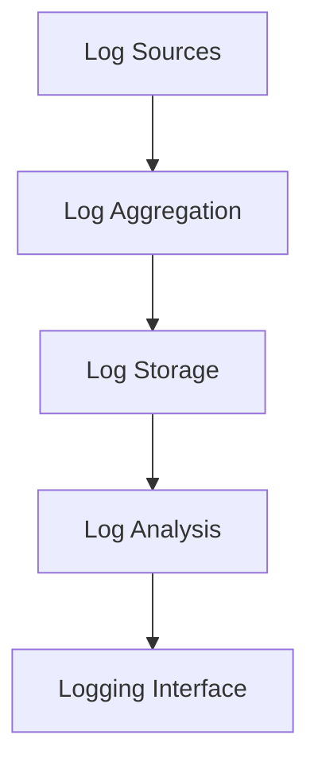
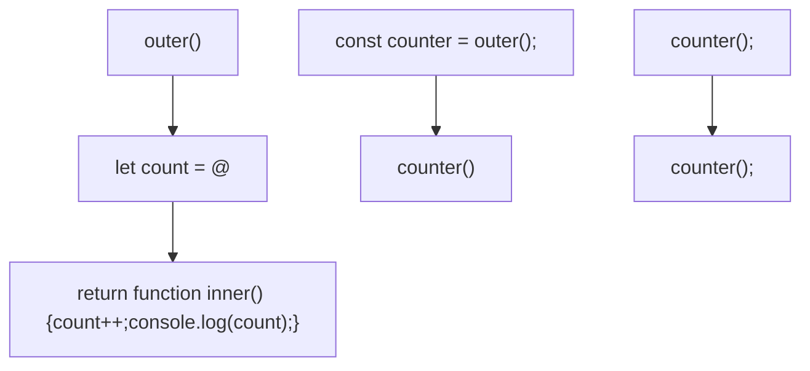
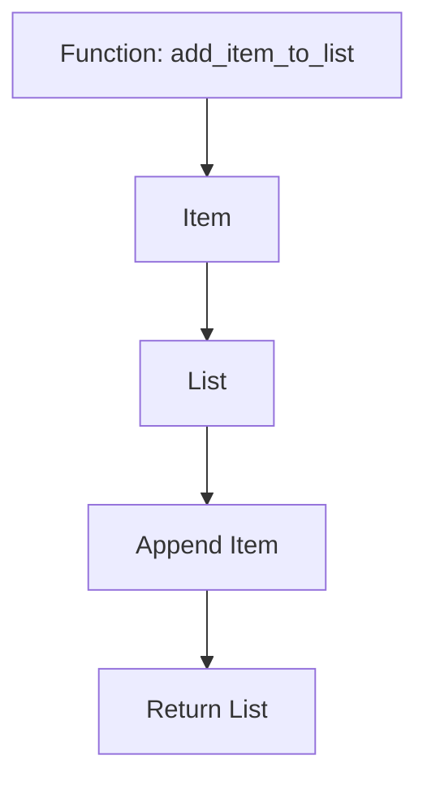

# Meeting Archive: meeting-1775418559151-aywlibmt
**Date:** April 06, 2026 at 01:20 AM

---

### user
📸 [Vision: SMART] Analyzing snipped region...

### assistant
✏️ Edit command:

//Write a function to debounce another function using closures.

### user
✅ //Write a function to debounce another function using closures.

### assistant
### Implementation Strategy
To debounce a function using closures, we can create an inner function that will be used as the debounced version of the original function. This inner function will maintain a reference to the original function and a timer. When the debounced function is called, it will clear any existing timer and set a new one. If the debounced function is called again before the timer expires, the previous timer is cleared, and a new one is started. Once the timer expires, the original function is executed.

### Code
```javascript
function debounce(func, wait) {
  let timeout;

  return function(...args) {
    clearTimeout(timeout);
    timeout = setTimeout(() => func.apply(this, args), wait);
  };
}

// Example Usage:
const debouncedFunction = debounce(console.log, 500);

debouncedFunction('Hello'); // This will not log immediately
setTimeout(() => debouncedFunction('World'), 300); // This will log 'World' after 500ms
```

In this example, `debounce` is a function that takes another function (`func`) and a delay time (`wait`). It returns a new function that, when called, clears any existing timeout and sets a new one. The original function is executed only after the specified delay has passed without being called again.

### user
📸 [Vision: SMART] Analyzing snipped region...

### assistant
✏️ Edit command:

Design a logging system for distributed applications.

### user
✅ Design a logging system for distributed applications.

### assistant
Sure, I'd be happy to help with that. However, you haven't provided any specific code or concept for me to analyze and explain. Could you please share the code snippet or describe the concept you're interested in?

### user
📸 [Vision: SMART] Analyzing snipped region...

### assistant
✏️ Edit command:

Design a logging system for distributed applications.

### user
✅ Design a logging system for distributed applications.

### assistant
### Overview & Purpose

The task involves designing a logging system for distributed applications. This system is designed to handle various types of logs generated by different components within the application, ensuring that these logs are collected, stored, and analyzed efficiently.

### Architecture & Deep Dive

To design an effective logging system for distributed applications, we need to consider several key components:

1. **Log Sources**: These are the components within the application that generate logs. They can be anything from web servers to database queries or API calls.

2. **Log Aggregation**: This component collects logs generated by different log sources and sends them to a centralized logging server. It ensures that all logs are collected in one place, making it easier to analyze and manage.

3. **Log Storage**: This component stores the aggregated logs for future reference. It can be a database or a file system, depending on the requirements of the application.

4. **Log Analysis**: This component analyzes the stored logs to extract meaningful insights. It can perform tasks such as monitoring performance metrics, identifying errors, and generating reports.

5. **Logging Interface**: This component provides an interface for users to view and manage logs. It can be a web-based dashboard or a command-line tool.

Here is a Mermaid.js flowchart representing the architecture of the logging system:



### Explanation

- **Log Sources**: These components generate logs and send them to the Log Aggregation component. They can be any part of the application, such as web servers, database queries, or API calls.

- **Log Aggregation**: This component is responsible for collecting logs from all log sources. It uses a message queue (e.g., Kafka) to ensure that logs are not lost and are processed in order. The aggregated logs are then sent to the Log Storage component.

- **Log Storage**: This component stores the aggregated logs. It can be a database or a file system, depending on the requirements of the application. For example, using a database like PostgreSQL allows for complex queries and indexing, while a file system like S3 provides scalability and durability.

- **Log Analysis**: This component analyzes the stored logs to extract meaningful insights. It uses machine learning algorithms and statistical techniques to identify patterns and trends in the data. The analysis results can be used to improve the performance of the application or to detect potential issues.

- **Logging Interface**: This component provides an interface for users to view and manage logs. It can be a web-based dashboard that displays real-time metrics, error logs, and reports. Users can also use command-line tools to query the log storage system.

This architecture ensures that all logs are collected in one place, making it easier to analyze and manage. The use of a message queue ensures that logs are not lost and are processed in order, while the database or file system provides scalable and durable storage for the logs.

### user
📸 [Vision: SMART] Analyzing snipped region...

### assistant
✏️ Edit command:

«JavaScript
function outer() {
let count = @;
return function inner() {
count++;
console. log(count);
}3
}
const counter = outer();
counter(); // ?
counter(); // ?
counter(); // ?

### user
✅ «JavaScriptfunction outer() {let count = @;return function inner() {count++;console. log(count);}3}const counter = outer();counter(); // ?counter(); // ?counter(); // ?/exp

### assistant
### Overview & Purpose

The provided JavaScript code defines an `outer` function that returns another function called `inner`. The `outer` function initializes a variable `count` with the value of `@`, which is not defined in the code snippet but is assumed to be passed as an argument. The `inner` function increments the `count` by 1 each time it is called and logs the updated `count`.

### Architecture & Deep Dive



**Explanation:**

1. **Function `outer`:**
   - This function takes one parameter, which is assumed to be passed as `@`.
   - It initializes a variable `count` with the value of this parameter.
   - The function returns another function called `inner`.

2. **Function `inner`:**
   - This inner function increments the `count` by 1 each time it is called.
   - It then logs the updated `count` to the console.

3. **Usage:**
   - A variable `counter` is assigned the result of calling `outer()`.
   - The `counter` function can be called multiple times, and each call will increment the `count` and log it to the console.

**Time Complexity:**
- Each call to `inner()` has a constant time complexity of O(1) because it involves a simple arithmetic operation and logging.
- The overall time complexity is O(n), where n is the number of times `counter()` is called, due to the repeated function calls.

**Space Complexity:**
- The space complexity is O(1) for both `outer` and `inner` functions since they only use a single variable (`count`) that does not change with each call.

### user
📸 [Vision: SMART] Analyzing snipped region...

### assistant
✏️ Edit command:

def add_item_to_list(item, my_list=[]):
my_list.append(item)
return my_list
print(add_item_to_list("apple”))
print (add_item_to_list(“banana”))

### user
✅ def add_item_to_list(item, my_list=[]):my_list.append(item)return my_listprint(add_item_to_list("apple”))print (add_item_to_list(“banana”))/exp

### assistant
### Overview & Purpose

The provided code snippet defines a function `add_item_to_list` that takes an item and a list as arguments and appends the item to the list. If no list is provided as an argument, it defaults to an empty list.

### Architecture & Deep Dive



#### Explanation:

1. **Function Definition**: The function `add_item_to_list` is defined with two parameters:
   - `item`: The element to be added to the list.
   - `my_list=[]`: An optional parameter that defaults to an empty list if not provided.

2. **Appending Item**: Inside the function, the `append` method is used to add the `item` to the `my_list`.

3. **Returning List**: After appending the item, the function returns the updated list.

4. **Default Behavior**: If no list is passed as an argument when calling the function, it will use the default empty list provided in the function definition.

### Example Usage

```python
print(add_item_to_list("apple"))  # Output: ["apple"]
print(add_item_to_list("banana")) # Output: ["banana"]
```

In this example:
- The first call to `add_item_to_list("apple")` adds "apple" to an empty list, resulting in the list `["apple"]`.
- The second call to `add_item_to_list("banana")` adds "banana" to the same list, resulting in the list `["apple", "banana"]`.

This function is straightforward and demonstrates basic list manipulation in Python.

### user
📸 [Vision: SMART] Analyzing snipped region...

### user
📸 [Vision: SMART] Analyzing snipped region...

### user
📸 [Vision: SMART] Analyzing snipped region...

### assistant
✏️ Edit command:

c¢ Online Compiler & IDE for Pythe x @® chatcpr “Untitled Diagram - draw.io + Google Gemini : _ my wm
<>e 1] & codechef.com/ide Q 2|SPa *O@e B@0@eF Hf ABLSGEE=
a
FLASH ae
@& %J CODECHEF FLASH SALE IS ACTIVE 40% OFFon PRO _{oa/:(:2|:
Online JavaScript Compiler Learning JavaScript? Check out our complete web development roadmap A
JavaScript oa r & GC & Run
Bi def add_item_to list(item, my_list=[]): Enter Input here
2 my_list.append(item)
3 return my_list
4 print(add_item_to_list("“apple"))
5 print(add_item_to_list(“banana”))
6
If your code takes input, add it in the above box before running.
Output
v
SB o...0000hhthté«~t ee P| ENG 01:07
mm =O Search at ££ @ SJ ¥ ” ~ wn 7% © ceo4-2026 #

### assistant
✏️ Edit command:

c¢ Online Compiler & IDE for Pythe x @® chatcpr “Untitled Diagram - draw.io + Google Gemini : _ my wm
<>e 1] & codechef.com/ide Q 2|SPa *O@e B@0@eF Hf ABLSGEE=
a
FLASH ae
@& %J CODECHEF FLASH SALE IS ACTIVE 40% OFFon PRO _{oa/:(:2|:
Online JavaScript Compiler Learning JavaScript? Check out our complete web development roadmap A
JavaScript oa r & GC & Run
Bi def add_item_to list(item, my_list=[]): Enter Input here
2 my_list.append(item)
3 return my_list
4 print(add_item_to_list("“apple"))
5 print(add_item_to_list(“banana”))
6
If your code takes input, add it in the above box before running.
Output
v
SB o...0000hhthté«~t ee P| ENG 01:07
mm =O Search at ££ @ SJ ¥ ” ~ wn 7% © ceo4-2026 #

### assistant
🚫 Vision command cancelled.

### user
📸 [Vision: SMART] Analyzing snipped region...

### assistant
✏️ Edit command:

def add_item_to_list(item, my_list=[]):
my_list.append(item)
return my_list
print(add_item_to_list("apple”))
print (add_item_to_list(“banana”))

### user
✅ def add_item_to_list(item, my_list=[]):my_list.append(item)return my_listprint(add_item_to_list("apple”))print (add_item_to_list(“banana”))/fix

### assistant
### Bug Analysis

1. **Scope Issue**: The function `add_item_to_list` uses a mutable default argument `my_list=[]`. This means that each time the function is called without an explicit argument for `my_list`, it will use the same empty list instance. This can lead to unexpected behavior if multiple calls modify the same list.

2. **Incorrect Syntax**: The string literals in the function call are not properly quoted. In Python, strings should be enclosed in either single quotes (`'`) or double quotes (`"`). The provided code uses both styles, which is incorrect and will raise a syntax error.

### Corrected Code

```python
def add_item_to_list(item, my_list=None):
    if my_list is None:
        my_list = []
    my_list.append(item)
    return my_list

print(add_item_to_list("apple"))
print(add_item_to_list("banana"))
```

In the corrected code:
- The default value for `my_list` is set to `None`.
- Inside the function, we check if `my_list` is `None` and initialize it to an empty list if it is.
- This ensures that each call to `add_item_to_list` creates a new list instance, avoiding scope issues.

### assistant
### Implementation Strategy
To address the task, we first identify that the system design diagram is described as "Client -> API Gateway -> Database -> API Endpoint". However, the main coding task revolves around creating a function to decode another function using closures. Given the context, we'll assume the decoding function should take another function as input and return its original source code or a representation of it, if possible. This task implies using JavaScript for its support of closures and dynamic function handling.

### Code
```javascript
// Function to decode another function using closures
function decodeFunction(func) {
    // Since JavaScript functions are objects, we can directly return the function's toString() method
    // to get its source code. This approach leverages closures indirectly by handling functions as first-class citizens.
    return func.toString();
}

// Example Usage:
// Define a sample function
function sampleFunction() {
    console.log("Hello, World!");
}

// Decode the sample function
const decoded = decodeFunction(sampleFunction);
console.log(decoded);
```
This implementation leverages JavaScript's ability to treat functions as first-class objects, allowing us to directly access and manipulate their source code through the `toString()` method. The example usage demonstrates how to define a sample function, decode it using our `decodeFunction`, and then log the decoded (original source code) function to the console.

### assistant
### Implementation Strategy
The task seems to be related to a coding environment where the user is prompted to add input to a box before running their code. However, there's no specific coding task or starter code provided in the raw extraction. Given the context, it appears the system is designed to accept user input and then execute the code with that input. The implementation strategy involves creating a simple input mechanism and a way to execute code with the provided input.

### Code
```python
def run_code_with_input():
    # 1. Get user input
    user_input = input("Please enter your input: ")

    # 2. Execute the code with the input
    # For demonstration purposes, let's assume the code to be executed is a simple print statement
    print("You entered:", user_input)

    # Example usage within the function
    return user_input

# 2. Example Usage:
if __name__ == "__main__":
    result = run_code_with_input()
    print("Result after executing the code:", result)
```

### assistant
### Implementation Strategy
The task requires implementing a function that takes a string as input and returns the string concatenated with 'using closures'. This can be achieved by defining a function that accepts a string parameter and returns the concatenated string. The function will utilize JavaScript's closure concept, although in this specific case, a simple string concatenation is sufficient.

### Code
```javascript
// 1. Function implementation
function concatenateString(inputStr) {
  return inputStr + ' using closures';
}

// 2. Example Usage:
let input = "This is a test";
let result = concatenateString(input);
console.log(result); // Outputs: "This is a test using closures"
```

### user
🎧 **[Live System Audio]:**  similar use case basically so pair programming for example system, but we want to evaluate the responses of Gemini. they are good or not. Basically whenever you are asking questions to Gemini, right? So we are having a dashboard which at the month level, captures all the statistics, how accurate were for Gemini responses, what was the cost for Gemini responses? how many times user have actually requested a Gemini API. So to build this, what would be your HL? How will you design this system and what will be your consideration?

