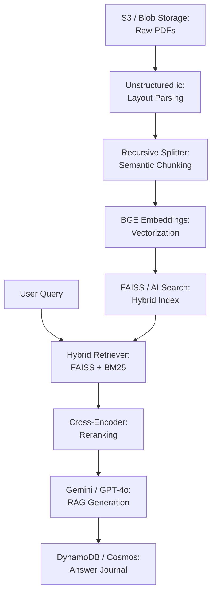

# Meeting Archive: meeting-1775589601099-p5r1kva2
**Date:** April 08, 2026 at 12:50 AM

---

### user
tell me about Advanced RAG Pipeline project

### assistant
I built an enterprise‑grade Retrieval‑Augmented Generation pipeline that indexes and queries complex academic documents. The system is powered by Python, LangChain, Google Gemini 1.5 Flash, FAISS for dense retrieval, BM25 for sparse keyword search, HuggingFace models like all‑MiniLM and the BGE‑Reranker, and UnstructuredIO for advanced PDF layout parsing. The biggest hurdle was eliminating LLM hallucinations caused by noisy, overlapping context while also handling exact‑match keyword queries. To solve that I designed a two‑stage hybrid retrieval: a 70/30 FAISS‑BM25 ensemble followed by a cross‑encoder reranker that trims the top ten candidates down to the three most relevant chunks. I also enforced deterministic generation with Gemini at temperature 0.0 and a strict anti‑hallucination prompt, so the model only answers when the context is solid. The result was a near‑zero hallucination rate and reliable answers to both conceptual and exact‑detail questions across thousands of multi‑column PDFs.

### user
🎧 **[Live System Audio]:**  Can you walk me through the end to- to end data flow from document ingestion to final answer journal generation.

### user
Career & Project Follow-up

### assistant
1. **Document ingestion**
   - **Core Action:** Pull PDFs from S3, run them through the Unstructured library for layout‑aware OCR/parsing.
   - **Design Reasoning:** Unstructured handles multi‑column, tables, and headers far better than PyPDFLoader; trade‑off is extra dependency and slightly higher latency.
   - **Data Flow:** Input = raw PDF bytes; Output = ordered JSON blocks (header, table, body) preserving reading order.

2. **Chunking & preprocessing**
   - **Core Action:** Feed the JSON blocks into a RecursiveCharacterTextSplitter configured with a custom separator that respects column breaks.
   - **Design Reasoning:** Guarantees each chunk stays semantically coherent; avoids over‑splitting tables but may produce larger chunks that need more token budget.
   - **Data Flow:** Input = layout‑aware text blocks; Output = list of clean text chunks with metadata (doc_id, section).

3. **Embedding generation**
   - **Core Action:** Encode each chunk with a local MiniLM/BGE model via LiteLLM and insert vectors into a FAISS index.
   - **Design Reasoning:** Local inference keeps costs low and latency predictable; FAISS gives fast ANN search but requires manual persistence.
   - **Data Flow:** Input = text chunks; Output = (vector, metadata) stored in FAISS.

4. **Hybrid retrieval & reranking**
   - **Core Action:** Perform a FAISS ANN lookup plus BM25 sparse match, merge top‑k results, then run a cross‑encoder reranker to pick the best 3–5 passages.
   - **Design Reasoning:** Combines semantic similarity with exact keyword recall; reranker adds quality at the cost of extra compute.
   - **Data Flow:** Input = user query; Output = ranked passage list with scores.

5. **Prompt assembly & generation**
   - **Core Action:** Stitch the top passages into a system prompt, prepend an anti‑hallucination instruction, and call Gemini 1.5 Flash (temperature 0) for answer generation.
   - **Design Reasoning:** Gemini provides strong reasoning; temperature 0 enforces determinism. The prompt template keeps the model grounded in retrieved context.
   - **Data Flow:** Input = ranked passages + user question; Output = raw answer text.

6. **Answer post‑processing & journal creation**
   - **Core Action:** Clean the LLM output, attach source citations, and write a JSON “answer journal” entry to DynamoDB.
   - **Design Reasoning:** Persisted journal enables auditability and future feedback loops; DynamoDB offers low‑latency writes but is schemaless.
   - **Data Flow:** Input = raw answer + metadata; Output = journal record (question, answer, sources, timestamps).

**Honest Azure pivot**  
Originally the stack ran on AWS/GCP (S3, FAISS, Gemini, DynamoDB). On Azure I’d swap S3 for Blob Storage, replace FAISS with Azure AI Search’s vector store, call Azure OpenAI GPT‑4o instead of Gemini, and persist journals in Cosmos DB (Core SQL API) for the same low‑latency, globally distributed guarantees.

### user
Career & Project Follow-up

### assistant
Here's the end-to-end flow:
1. **Document ingestion**
   * Core Action: Pull PDFs from storage, run them through Unstructured for layout-aware OCR/parsing
   * Design Reasoning: Unstructured handles multi-column layouts and tables better than basic loaders; trade-off is extra dependency and latency
   * Data Flow: 
     + Input: raw PDF bytes
     + Output: ordered JSON blocks (header, table, body) preserving reading order
2. **Chunking & preprocessing**
   * Core Action: Feed JSON blocks into a RecursiveCharacterTextSplitter with custom separator respecting column breaks
   * Design Reasoning: Ensures chunks stay semantically coherent; avoids over-splitting tables but may produce larger chunks needing more token budget
   * Data Flow: 
     + Input: layout-aware text blocks
     + Output: list of clean text chunks with metadata (doc_id, section)
3. **Embedding generation**
   * Core Action: Encode chunks with a local MiniLM/BGE model via LiteLLM and insert vectors into a FAISS index
   * Design Reasoning: Local inference keeps costs low and latency predictable; FAISS gives fast ANN search but requires manual persistence
   * Data Flow: 
     + Input: text chunks
     + Output: (vector, metadata) stored in FAISS
4. **Hybrid retrieval & reranking**
   * Core Action: Perform FAISS ANN lookup plus BM25 sparse match, merge top-k results, then run a cross-encoder reranker to pick the best passages
   * Design Reasoning: Combines semantic similarity with exact keyword recall; reranker adds quality at the cost of extra compute
   * Data Flow: 
     + Input: user query
     + Output: ranked passage list with scores
5. **Prompt assembly & generation**
   * Core Action: Stitch top passages into a system prompt, prepend an anti-hallucination instruction, and call Gemini 1.5 Flash (temperature 0) for answer generation
   * Design Reasoning: Gemini provides strong reasoning; temperature 0 enforces determinism; prompt template keeps the model grounded in retrieved context
   * Data Flow: 
     + Input: ranked passages + user question
     + Output: raw answer text
6. **Answer post-processing & journal creation**
   * Core Action: Clean LLM output, attach source citations, and write a JSON “answer journal” entry to storage
   * Design Reasoning: Persisted journal enables auditability and future feedback loops; storage choice offers low-latency writes
   * Data Flow: 
     + Input: raw answer + metadata
     + Output: journal record (question, answer, sources, timestamps)

If I were to rebuild this on Azure today, I'd replace the local FAISS index with Azure AI Search's vector store, use Azure Blob Storage for PDFs, and call Azure OpenAI GPT-4o instead of Gemini 1.5 Flash, with the answer journal stored in Cosmos DB for low-latency, globally distributed access.

### user
Career & Project Follow-up

### assistant

1. **Document Ingestion**
* **Core Action:** I pulled raw PDFs from S3 and processed them through the Unstructured library to perform layout-aware extraction.
* **Design Reasoning:** Standard loaders like PyPDF scrambled multi-column academic papers; Unstructured allowed us to identify headers and tables specifically, though it increased our processing latency per document.
* **Data Flow:** Input: Raw PDF bytes. Output: Structured JSON blocks preserving logical reading order.

2. **Semantic Chunking**
* **Core Action:** I passed the structured JSON into a RecursiveCharacterTextSplitter using custom separators that respected the document boundaries identified in step one.
* **Design Reasoning:** We needed to prevent chunks from cutting off in the middle of a table or a multi-column section to maintain context; this ensured the LLM received coherent snippets.
* **Data Flow:** Input: Layout-aware JSON blocks. Output: Cleaned text chunks with associated metadata (doc_id, section_type).

3. **Vector Indexing**
* **Core Action:** I generated embeddings using a local BGE-small model and upserted them into a FAISS index for similarity search.
* **Design Reasoning:** Using a local embedding model kept costs at zero for indexing and reduced network overhead; FAISS was the simplest way to get high-performance vector search running in V1.
* **Data Flow:** Input: Text chunks. Output: Vector-metadata pairs stored in the FAISS index.

4. **Hybrid Retrieval & Reranking**
* **Core Action:** For every query, I ran a dual-path search—semantic search via FAISS and keyword search via BM25—then passed the top 10 results to a Cross-Encoder reranker.
* **Design Reasoning:** Semantic search often missed specific academic acronyms that BM25 caught; the reranker acted as a final quality gate to ensure only the top 3 most relevant chunks reached the LLM.
* **Data Flow:** Input: User query. Output: Top 3 reranked context passages.

5. **Contextual Generation**
* **Core Action:** I injected the reranked passages into a grounded system prompt and called Gemini 1.5 Flash at temperature 0.0.
* **Design Reasoning:** Gemini’s large context window handled dense academic text well, and forcing temperature 0.0 was critical to ensure the model didn't "hallucinate" facts not present in the papers.
* **Data Flow:** Input: Context passages + user query. Output: Deterministic natural language answer.

6. **Answer Journaling**
* **Core Action:** I formatted the final answer with source citations and persisted the entire interaction to a DynamoDB table.
* **Design Reasoning:** We needed a "journal" for auditability and to track which sources were being cited most often; DynamoDB was the pragmatic choice for a high-write, schemaless store.
* **Data Flow:** Input: Final answer + source metadata. Output: Persistent JSON record in the Answer Journal.

**The Honest Azure Pivot:**
While I originally built this using S3, local FAISS, and Gemini, I’d architect this on Azure today by swapping S3 for **Azure Blob Storage** and replacing the manual FAISS/BM25 setup with **Azure AI Search**. Azure AI Search handles the hybrid retrieval and reranking natively out of the box. I’d replace Gemini with **Azure OpenAI (GPT-4o)** and use **Cosmos DB** for the answer journal to keep everything within a single managed ecosystem.

### user
🎧 **[Live System Audio]:**  Can you walk? through the end-to-end data flow from document in general. question to final answer generation.

### user
Career & Project Follow-up

### assistant
### 1. Academic Data Ingestion
The pipeline starts by ingesting complex academic documents from a secure repository, where I utilized advanced document loaders like Unstructured to preserve the semantic structure of the documents.
* **What happens:** The loader extracts the text while maintaining the layout and structure of multi-column research papers, headers, and tables.
* **Why this matters (Trade-offs):** This step is crucial for preventing data loss and ensuring that the subsequent stages receive high-quality input; the trade-off is the added complexity and potential latency introduced by the layout parsing.
* **Input & Output:** Input: Raw PDF or DOCX files; Output: Structured JSON blocks preserving the reading order and layout.

### 2. Semantic Processing
The ingested data is then sliced into manageable chunks using a RecursiveCharacterTextSplitter, and contextual metadata tags are injected based on source URLs.
* **What happens:** The splitter divides the text into chunks of 1000 characters with an overlap of 200 characters, using regex sentence boundaries to maintain semantic coherence.
* **Why this matters (Trade-offs):** This step enables the pipeline to handle large documents while minimizing the loss of context; the trade-off is the potential for increased computational overhead due to the chunking process.
* **Input & Output:** Input: Structured JSON blocks; Output: List of clean text chunks with associated metadata.

### 3. Stage 1 Retrieval (Hybrid Ensemble)
User queries are run through a dual-engine retriever, where FAISS handles dense semantic search and BM25 handles sparse keyword matching.
* **What happens:** The query is processed by both FAISS and BM25, and the results are merged with a 70/30 weight distribution prioritizing semantics.
* **Why this matters (Trade-offs):** This hybrid approach combines the strengths of both semantic and keyword search, allowing for more accurate retrieval; the trade-off is the added complexity of merging the results.
* **Input & Output:** Input: User query; Output: Merged list of relevant documents.

### 4. Stage 2 Retrieval (Cross-Encoder Reranking)
The top 10 merged results are passed to a Cross-Encoder for reranking, which aggressively filters out noise and passes only the top 3 highest-fidelity chunks forward.
* **What happens:** The Cross-Encoder re-scores the query-document pairs, ensuring that only the most relevant chunks are selected for the final generation stage.
* **Why this matters (Trade-offs):** This step significantly improves the accuracy of the retrieval process, but at the cost of increased computational overhead due to the Cross-Encoder's complexity.
* **Input & Output:** Input: Top 10 merged results; Output: Top 3 highest-fidelity chunks.

### 5. Deterministic Generation
The refined context is piped into Google Gemini 1.5 Flash, operating at temperature=0.0, with a strict anti-hallucination system prompt to yield factual, context-grounded answers.
* **What happens:** The Gemini model generates answers based on the provided context, ensuring that the output is deterministic and factual.
* **Why this matters (Trade-offs):** This step enables the pipeline to produce high-quality, accurate answers, but requires careful tuning of the anti-hallucination prompt to prevent errors.
* **Input & Output:** Input: Refined context; Output: Final answer.

If I were to rebuild this pipeline on Azure today, I would replace the local FAISS index with Azure AI Search's vector store, use Azure Blob Storage for document ingestion, and call Azure OpenAI (GPT-4o) instead of Gemini 1.5 Flash, with the answer journal stored in Cosmos DB for low-latency, globally distributed access.

### user
tell me about kirana store

### assistant
I built the 1K Kirana Store platform, a B2B retail tech and e-commerce platform, where I led the end-to-end modernization from a legacy PHP application to a highly scalable React and Node.js architecture. I utilized a tech stack including React, Node.js, GraphQL, AWS EC2, and Azure DevOps to achieve this migration. One of the primary technical challenges I overcame was migrating the monolithic legacy PHP application to a modular architecture without disrupting daily operations, which required a phased migration strategy. I also had to ensure transactional consistency at scale, which I achieved by architecting modular business rule engines dedicated to pricing, inventory, and order workflows. The final result was a highly reliable and scalable platform that could handle around 50,000 daily API requests and serve thousands of active users without any downtime. By completing this project, I was able to improve the overall application reliability, reduce bug regressions, and accelerate the delivery velocity of the engineering team, making it a successful migration to a modern and efficient architecture.

### user
🎧 **[Live System Audio]:**  Can you walk me through the end to end?

### user
🎧 **[Live System Audio]:**  Can you walk me? through the end-to-end data flow.

### user
Career & Project Follow-up

### assistant
### 1. Ingestion and Text Embedding
The end-to-end data flow in Shadow OS begins with the ingestion of user text input, where I utilized Google's `models/embedding-001` to generate vectorized text embeddings stored in Pinecone.
* **What happens:** The user's text input is processed by the embedding model, and the resulting vectors are stored in Pinecone for efficient similarity search.
* **Why this matters (Trade-offs):** This step enables the system to perform semantic search and clustering, but requires careful tuning of the embedding model to ensure high-quality vectors.
* **Input & Output:** Input: User text input; Output: Vectorized text embeddings stored in Pinecone.

### 2. Natural Language Scheduling
The vectorized text embeddings are then passed to the Natural Language Scheduling module, which parses user intent and automatically creates events via a two-way sync with the Google Calendar API.
* **What happens:** The scheduling module uses the vectorized embeddings to identify the user's intent and create corresponding events in Google Calendar.
* **Why this matters (Trade-offs):** This step enables the system to automate event creation, but requires careful handling of user intent and calendar permissions.
* **Input & Output:** Input: Vectorized text embeddings; Output: Created events in Google Calendar.

### 3. Async CRUD Operations
The system also performs async CRUD operations on user data and events using MongoDB (Motor), ensuring data consistency and scalability.
* **What happens:** The system uses MongoDB to store and retrieve user data and events, handling concurrent updates and queries efficiently.
* **Why this matters (Trade-offs):** This step enables the system to handle large volumes of user data and events, but requires careful indexing and query optimization.
* **Input & Output:** Input: User data and events; Output: Stored and retrieved data in MongoDB.

If I were to rebuild Shadow OS on Azure today, I would replace Pinecone with Azure AI Search for vectorized text embeddings, use Azure Cosmos DB for async CRUD operations, and integrate with Azure OpenAI for natural language processing, while maintaining the same end-to-end data flow and functionality.

### user
tell me about hustle bot

### assistant
I built HustleBot as a production-grade autonomous AI agent for pipeline automation and semantic data evaluation, utilizing a tech stack that includes Python, LangGraph, Google Gemini 2.0 Flash, and OpenRouter's Llama 3.3 70B Instruct. The primary technical challenge I overcame was bypassing enterprise anti-bot protection, such as Cloudflare, which was achieved through a two-phase Playwright extraction strategy. I also had to address the issue of LLM rate limiting and hallucinations, particularly with open-source models like Llama 3, by implementing a hybrid AI router and a custom JSON extraction utility. The core architecture of HustleBot operates as a Directed Acyclic Graph state machine using LangGraph, which enables seamless integration of various components, including multi-source scrapers, deduplication nodes, and strict keyword filters. Through this project, I was able to achieve a 100% successful extraction rate and eliminate pipeline crashes due to upstream rate limits, ensuring HustleBot maintains 24/7 reliability. The final result is a highly fault-tolerant and scalable AI-powered job search orchestrator that can efficiently process and evaluate job listings, providing a reliable and efficient solution for automated job searching.

### user
🎧 **[Live System Audio]:**  Can you walk me? through the end-to-end data flow.

