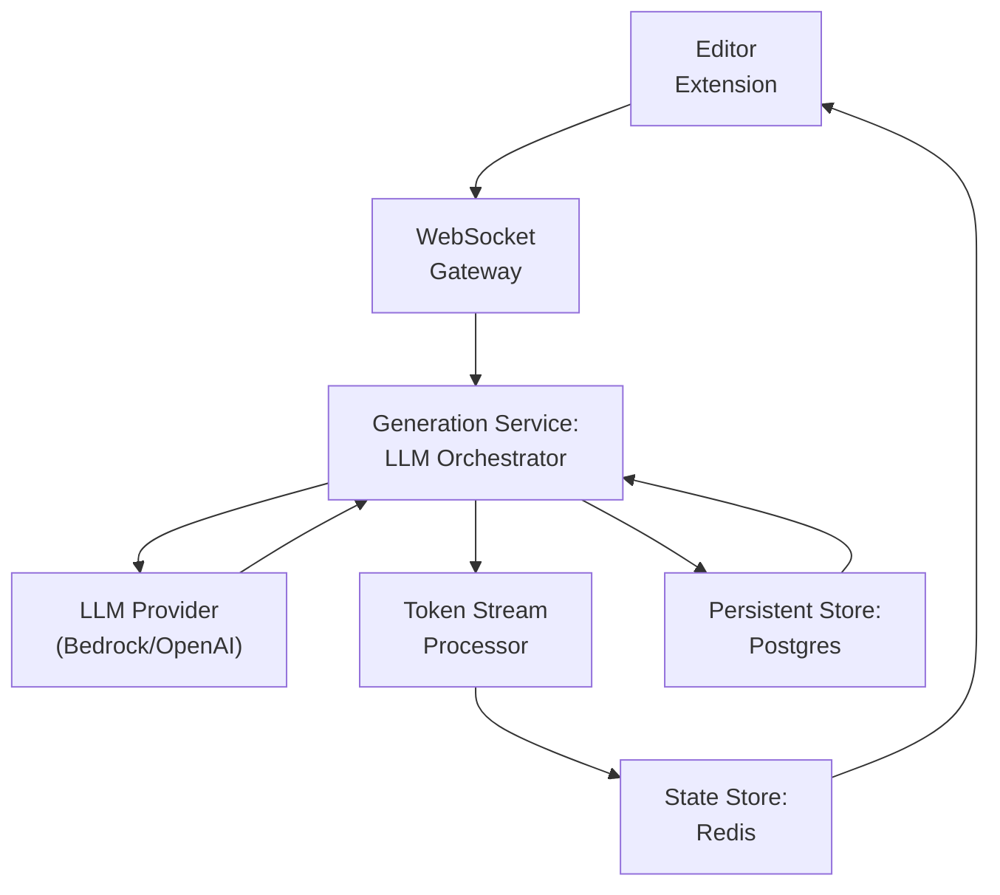

# Meeting Archive: meeting-1775648996313-hpfzedm9
**Date:** April 08, 2026 at 05:20 PM

---

### user
🎧 **[Live System Audio]:**  life cycle of code generating to like cursor.

### user
Quick Answer

### assistant
The code‑generation lifecycle starts when the editor sends the current context to the LLM. The model processes the prompt and streams tokens back to the client. The client buffers the stream and inserts each token at the cursor position. After insertion, the editor updates its syntax tree and refreshes UI highlights. Undo history records the whole insertion as a single operation for easy rollback. If latency spikes, you’d just enable token‑level streaming to keep the cursor responsive.

### user
Full Interview Analysis

### assistant
# 
### 1. The True Intent
Explain the end‑to‑end lifecycle of how an LLM‑based code generator streams tokens and inserts them at the editor cursor.

### 2. The Current Pivot & Cheat Sheet
**They want a concise walkthrough of the code‑generation‑to‑cursor flow.**  
- I start by describing the editor sending the current file context and cursor position to the backend service.  
- Next, I note the LLM receives the prompt, runs inference, and begins streaming token chunks.  
- Then I explain the client‑side streaming handler buffers each token and injects it directly at the cursor location.  
- After insertion, the editor updates its syntax tree, syntax highlighting, and undo stack as a single atomic operation.  
- Finally, I mention latency tricks—token‑level streaming, back‑pressure handling, and fallback to cached snippets for a smooth typing experience.

### 3. Architect Follow-Ups
1. Are you interested in the client‑side implementation details (e.g., WebSocket vs. SSE) or the backend inference pipeline?  
2. Do you need guidance on handling error recovery when the LLM fails mid‑stream (e.g., retry, rollback, or partial insert)?

### 4. Category
[CONCEPT]

### user
Technical Deep Dive

### assistant
### 1. The Elevator Pitch  
Code‑gen to cursor is a token‑level streaming loop: the editor sends context, the LLM streams tokens back, and the client injects each token at the caret in real time.

### 2. Core Mechanics  
1. Editor captures file snapshot and cursor offset, posts to a generation endpoint (usually via WebSocket).  
2. Backend builds a prompt, runs inference, and yields tokens as a continuous stream respecting the token limit.  
3. Client receives chunks, buffers a small batch (e.g., 3‑5 tokens) to avoid UI thrash, then inserts them at the saved offset, updating the syntax tree and undo stack atomically.  
4. After each insert the UI re‑highlights and optionally runs a quick lint check.  
5. If the stream ends early or errors, the client rolls back the partial insert to keep the document consistent.

### 3. Top Options & Trade‑offs  
- **WebSocket**: true bidirectional low‑latency, but requires connection management; best when you need cancel/retry.  
- **Server‑Sent Events**: simpler, one‑way, higher latency on reconnection; okay for low‑traffic internal tools.  
- **Batch‑size tuning**: larger batches reduce render overhead (lower CPU) but increase perceived latency; optimal batch ~4 tokens for most editors.  
We start with WebSocket + 4‑token batches; switch to SSE only if infrastructure constraints force it.

### 4. Production Example  
In our VS Code extension, on “Generate” we send the current file plus cursor line to an AWS Lambda that calls Bedrock. Bedrock streams tokens over a WebSocket; the extension buffers four tokens, inserts them at the caret, runs the TypeScript language service for on‑the‑fly diagnostics, and pushes the whole edit as a single undo step. If the stream drops, we revert the edit and show a toast, preventing corrupted code from persisting.

### user
System Design

### assistant
### 1. High-Level Architecture (Spoken overview)  
We have a thin client extension in the editor that talks to a WebSocket gateway. The gateway forwards the request to a generation service that builds the prompt and calls the LLM provider (e.g., Bedrock or OpenAI). The LLM streams tokens back, the service pipes them through a lightweight token‑stream processor, and pushes each chunk to the client. The client buffers a few tokens, inserts them at the saved cursor offset, updates the syntax tree, and records the edit as a single undo step. A Redis cache holds short‑lived session state (cursor position, token buffer) while a Postgres log stores usage metrics and user‑snippets for later analysis.

### 2. End-to-End Data Flow (Conversational walkthrough)  
1. **Editor captures context** – when the user hits “Generate”, the extension grabs the file snapshot, cursor line/column, and any selected prompt, then opens a WebSocket connection.  
2. **Request to gateway** – the payload goes to a stateless WebSocket gateway that authenticates the user and forwards the message to the generation service.  
3. **Prompt assembly** – the generation service pulls any relevant snippets from Postgres, stitches them with the live context, and sends the prompt to the LLM provider via its streaming API.  
4. **Token streaming** – the LLM streams tokens back; the service’s token‑stream processor adds minimal framing (e.g., sequence numbers) and pushes each chunk into Redis as a short‑lived stream.  
5. **Client consumption** – the extension subscribes to the Redis stream (or receives directly over the WebSocket), buffers 3‑5 tokens, then inserts them at the original cursor offset, runs a quick lint pass, and updates the UI.  
6. **Undo grouping** – once the stream ends or the user cancels, the client collapses all inserts into a single undo transaction and writes a usage record to Postgres for analytics.  
7. **Error handling** – if the stream drops, the client rolls back the partial edit using the saved snapshot and surfaces a toast; the service can retry automatically up to a configurable limit.

### 3. Architecture Diagram

### 4. Database Strategy (Spoken justification)  
For durable data—user snippets, audit logs, and analytics—we stick with a single Postgres instance; it gives ACID guarantees and easy SQL queries for reporting. The real‑time token buffer and cursor state are transient, so a lightweight Redis cluster is enough; its TTL feature automatically expires per‑generation streams, keeping memory tidy. No need for a NoSQL store at V1; we can add DynamoDB later if write volume spikes.

### 5. Scalability & Bottlenecks  
- **WebSocket gateway** can be horizontally scaled behind a load balancer; sticky sessions aren’t required because state lives in Redis.  
- **Generation service** is stateless; we can autoscale based on request latency, and the LLM provider’s rate limits become the primary throttle.  
- **Redis** is the hot path; keep payloads small (raw token strings) and use pipelining to avoid round‑trip overhead.  
- **Editor UI** may become a bottleneck if we insert too many tokens at once; buffering 3‑5 tokens balances responsiveness and render cost.  
- **Postgres** writes are low‑volume (analytics), so a single primary should suffice; monitor connection pool size and add read replicas if reporting load grows.

### user
🎧 **[Live System Audio]:**  Can you explain the off? architecture behind code generating to like cursor, like How does it actually know what I want to type next without hallucinate?

