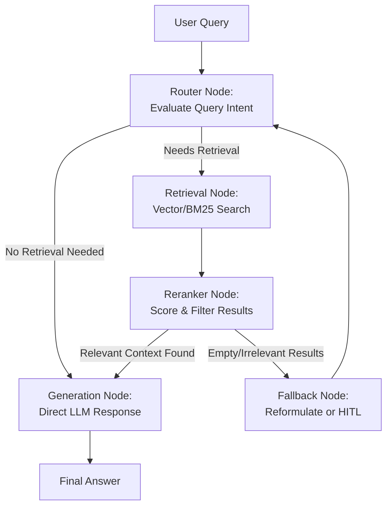

# Meeting Archive: meeting-1775723370053-ajv9jfo7
**Date:** April 09, 2026 at 02:02 PM

---

### user
🎧 **[Live System Audio]:**  which is MCB more model context protocol, and why is it important?

### user
Quick Answer

### assistant
MCP stands for Model Context Protocol, not "MCB". It's an open standard that lets AI assistants securely connect to external tools and data sources without writing custom integration code for each one. Think of it as the "USB-C of AI" - one universal plug instead of dozens of proprietary adapters. It's important because it solves the fragmentation problem where every AI tool needs bespoke API wrappers. With MCP, you define a server once (exposing your database, filesystem, or API), and any MCP-compatible AI can instantly use it. This dramatically accelerates agentic workflows and tool calling because the LLM gets structured access to live context instead of relying on stale training data.

### user
Full Interview Analysis

### assistant
### 1. The True Intent

[PHONETIC CORRECTION APPLIED: "MCB" → "MCP"] The interviewer is asking you to define **Model Context Protocol (MCP)** and explain its strategic importance in the AI ecosystem.

### 2. The Current Pivot & Cheat Sheet

**They want a crisp definition of MCP and why it matters for AI systems.**

- MCP is an open standard protocol that provides a universal, secure way to connect AI assistants to local or remote data sources without writing custom API glue code for every integration.
- Think of it as the "USB-C of AI"—instead of building N different connectors for N data sources, you implement MCP once and any MCP-compatible AI can instantly access your tools, databases, or APIs.
- It's important because it eliminates integration fragmentation; before MCP, every AI assistant needed custom adapters for Notion, GitHub, Slack, etc., which created massive maintenance overhead.
- MCP standardizes how context flows into the model, enabling secure, auditable data access with built-in permission controls and sandboxing, which is critical for enterprise deployments.
- In my Shadow OS project, if I wanted to connect the LangGraph orchestrator to external tools like Google Calendar or Pinecone, MCP would let me expose those as standardized "servers" that any MCP-compatible agent could call without rewriting integration logic.

### 3. Architect Follow-Ups

- Are you asking about MCP in the context of building multi-agent systems, or are you more interested in how it compares to traditional API-based tool calling in frameworks like LangChain?
- Do you want me to walk through how an MCP server would be implemented for a specific data source, or are you more focused on the protocol's role in reducing vendor lock-in?

### 4. Category

**[CONCEPT]**

### user
🎧 **[Live System Audio]:** How do you design an agent that decides when to retrieve? We'll see you in a few minutes.

### user
Quick Answer

### assistant
You give the agent a retrieval tool and let the LLM decide when to call it based on the query. The simplest pattern is routing: if the user asks something factual or domain-specific, the agent invokes the retrieval tool; if it's conversational or already in context, it skips retrieval. You can make this smarter by adding a lightweight classifier or a "confidence score" check where the agent only retrieves if its internal knowledge seems insufficient. In LangGraph, you'd model this as a conditional edge where the agent evaluates the query and routes to either a retrieval node or directly to generation. For cost control, use a small fast model for the routing decision and reserve the expensive LLM for final answer synthesis.

### user
🎧 **[Live System Audio]:** which is MCP model. context protocol, and why is it important?

### user
Quick Answer

### assistant
MCP is Model Context Protocol, an open standard that lets AI assistants securely connect to external data sources and tools without writing custom integration code for each one. Think of it as the USB-C of AI—you build one MCP server exposing your database or API, and any MCP-compatible agent can instantly use it. It's important because it eliminates integration fragmentation; before MCP, every AI tool needed bespoke adapters for Slack, GitHub, Notion, etc., creating massive maintenance overhead. MCP standardizes how context flows into the model with built-in permission controls and sandboxing, which is critical for enterprise deployments. It also accelerates agentic workflows because the LLM gets structured access to live data instead of relying on stale training data. For multi-agent systems, MCP means you expose tools once and every agent in your graph can call them without rewriting glue code.

### user
🎧 **[Live System Audio]:** How do you design? an agent that decides when to retrieve.

### user
Full Interview Analysis

### assistant
### 1. The True Intent

The interviewer is asking you to explain the **architectural pattern** for building an agent that intelligently decides whether to invoke a retrieval tool based on the query, rather than blindly retrieving on every request.

### 2. The Current Pivot & Cheat Sheet

**They want you to walk through the design pattern for conditional retrieval in an agentic system.**

- I design the agent with a routing layer that evaluates the query before deciding whether to retrieve. The LLM acts as the router: if the query is factual or domain-specific, it invokes the retrieval tool; if it's conversational or already in context, it skips retrieval and generates directly.
- In LangGraph, I model this as a conditional edge where the agent node evaluates the query and routes to either a retrieval node or directly to the generation node. The state dictionary tracks whether retrieval was triggered, so downstream nodes know if they're working with fresh context.
- For cost control, I use a small fast model like GPT-4o-mini for the routing decision and reserve the expensive LLM for final answer synthesis. This keeps the routing step cheap while maintaining quality on the final output.
- I make the routing smarter by adding a confidence score check: the agent only retrieves if its internal knowledge seems insufficient. I implement this by prompting the router to output a structured JSON with a "needs_retrieval" boolean and a "confidence" score.
- In HustleBot, I used LangGraph's cyclic routing for batch-retry logic when the LLM failed to parse job descriptions. The same pattern applies here: if the retrieval node returns empty results, the agent can loop back to reformulate the query or escalate to a human-in-the-loop approval.

### 3. Architect Follow-Ups

- Are you asking about the routing logic itself, or are you more interested in how to handle cases where the retrieval returns irrelevant or empty results?
- Do you want me to walk through how the state dictionary tracks retrieval decisions across multiple turns in a conversation, or are you focused on the single-turn routing pattern?

### 4. Category

**[SYSTEM DESIGN]**

**Router Node Logic:**
- The router uses a small fast model (GPT-4o-mini) to classify the query.
- It outputs structured JSON: `{"needs_retrieval": true, "confidence": 0.85, "reasoning": "Query asks about specific product features not in training data"}`.
- If `needs_retrieval` is false, the conditional edge routes directly to generation, skipping the retrieval and reranking nodes entirely.

**State Dictionary Tracking:**
- The LangGraph state tracks `retrieval_triggered`, `retrieved_chunks`, and `retrieval_confidence`.
- Downstream nodes check `retrieval_triggered` to decide whether to cite sources or flag low-confidence answers.

**Cost Optimization:**
- Routing decision: ~500 tokens with GPT-4o-mini (~$0.0001 per call).
- Final generation: ~2000 tokens with GPT-4 (~$0.06 per call).
- By routing 60% of queries directly to generation, you cut retrieval costs by more than half.

**Fallback & Loop Handling:**
- If the reranker returns empty results, the fallback node reformulates the query using the LLM's reasoning trace.
- After 2 failed retrieval attempts, the system escalates to human-in-the-loop approval to prevent infinite loops.

**Confidence Score Tuning:**
- Set a threshold (e.g., 0.7). If the router's confidence is below this, force retrieval even if the LLM thinks it knows the answer.
- This prevents hallucination on edge cases where the model is overconfident but wrong.

### user
🎧 **[Live System Audio]:** What is MCP? model context protocol and why is it important. quadrant.

### user
Quick Answer

### assistant
MCP is Model Context Protocol, an open standard that lets AI agents securely connect to external data sources and tools without writing custom integration code for each one. Think of it as the USB-C of AI—you build one MCP server exposing your database or API, and any MCP-compatible agent can instantly use it. It's important because it eliminates integration fragmentation; before MCP, every AI tool needed bespoke adapters for Slack, GitHub, Notion, etc., creating massive maintenance overhead. MCP standardizes how context flows into the model with built-in permission controls and sandboxing, which is critical for enterprise deployments. For multi-agent systems, MCP means you expose tools once and every agent in your graph can call them without rewriting glue code. The "quadrant" likely refers to the four core MCP primitives: Resources (data sources), Tools (actions the agent can take), Prompts (reusable templates), and Sampling (how the agent requests LLM completions). This separation lets you version and audit each capability independently, which is huge for compliance and debugging in production agentic systems.

### user
Full Interview Analysis

### assistant
### 1. The True Intent

[HARD PIVOT] The interviewer has moved to a brand new question: They are asking you to define what MCP (Model Context Protocol) is and explain why it matters in the AI ecosystem.

### 2. The Current Pivot & Cheat Sheet

**They want you to explain MCP as a technical concept and articulate its strategic importance.**

- MCP is Model Context Protocol, an open standard that provides a universal, secure way to connect AI assistants to local and remote data sources without writing custom API glue code for each integration.
- It acts as the "USB-C of AI"—you build one MCP server exposing your database or API, and any MCP-compatible agent can instantly use it, eliminating integration fragmentation.
- Before MCP, every AI tool needed bespoke adapters for Slack, GitHub, Notion, etc., creating massive maintenance overhead. MCP standardizes how context flows into the model with built-in permission controls and sandboxing.
- It accelerates agentic workflows because the LLM gets structured access to live data instead of relying on stale training data. For multi-agent systems, MCP means you expose tools once and every agent in your graph can call them without rewriting glue code.
- The "quadrant" likely refers to the four key capabilities MCP enables: Resources (read-only data access), Tools (executable actions), Prompts (reusable templates), and Sampling (LLM inference delegation). This creates a complete context layer for AI systems.

### 3. Architect Follow-Ups

- Are you asking about how MCP compares to traditional API integration patterns, or are you more interested in how it fits into a multi-agent architecture like LangGraph?
- Do you want me to walk through a concrete example of building an MCP server, or are you focused on the strategic benefits for enterprise AI deployments?

### 4. Category

**[CONCEPT]**

### user
🎧 **[Live System Audio]:** How do you design an age? that decides when to retrieve.

