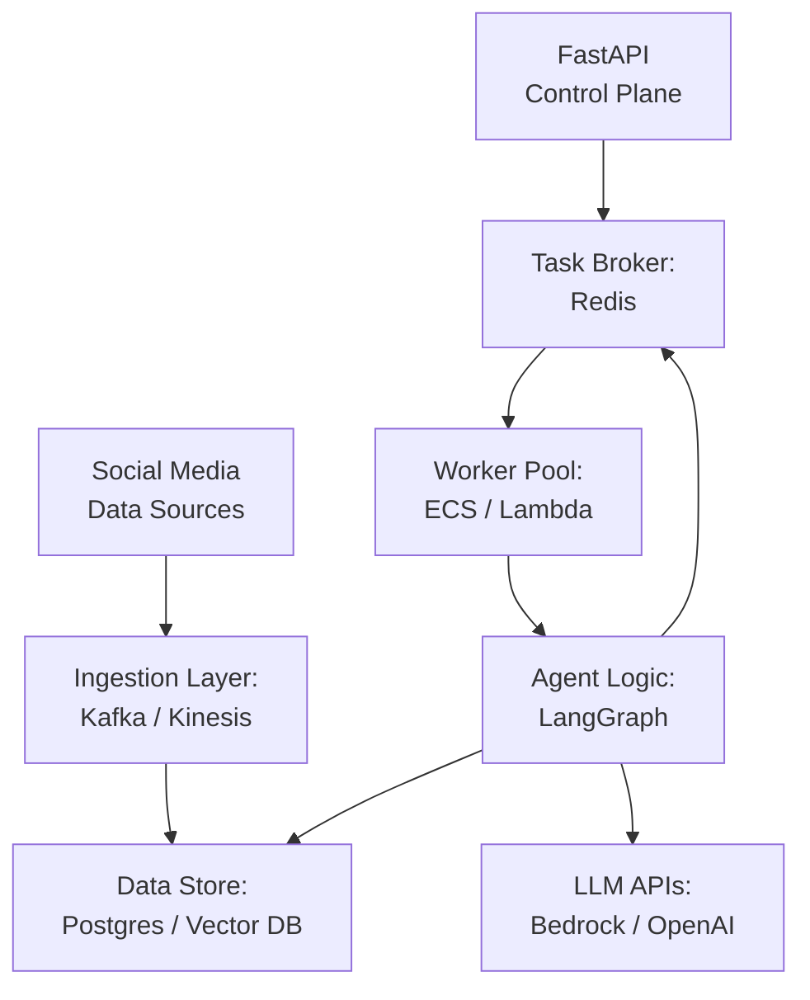

# Meeting Archive: meeting-1775730684111-bsl8gvzk
**Date:** April 09, 2026 at 04:01 PM

---

### user
🎧 **[Live System Audio]:**  How would you design the back-end architecture for our marketing? to handle 10,000 concurrent AI agent executions and real-time data in general. from social media papers.

### user
Quick Answer

### assistant
I'd use a distributed task queue like Celery with Redis as the broker to handle 10k concurrent agent executions. Each agent runs as an async worker pulling tasks from the queue. For real-time social media ingestion I'd set up Kafka or AWS Kinesis to stream posts into the system. The agents themselves would be LangGraph workflows orchestrated by a FastAPI control plane. Store intermediate state in Redis and final results in Postgres. Scale horizontally by spinning up more worker containers in ECS or Lambda for burst traffic. Monitor with CloudWatch to auto-scale based on queue depth.

### user
Quick Answer

### assistant
I'd use a distributed task queue with Redis and Celery to handle the 10k concurrent agents. This decouples the request from the execution so the system doesn't crash. For the social media ingestion, I'd pipe everything through Kafka or Kinesis for real-time streaming. I'd build the agents using LangGraph with a Supervisor pattern to manage complex workflows. Use state dictionaries and checkpointing to keep track of agent memory across steps. I'd stick to a FastAPI control plane and scale workers on ECS or Lambda. Finally, I'd implement max recursion limits and Pydantic validation to keep the agents from looping infinitely.

### user
Full Interview Analysis

### assistant
### 1. The True Intent
The interviewer wants a scalable, end-to-end technical architecture capable of handling high-concurrency AI agent orchestration and real-time data ingestion from external social media sources.

### 2. The Current Pivot & Cheat Sheet
**They are asking for a high-scale system design to orchestrate 10k concurrent AI agents and real-time data streams.**

*   Use a distributed task queue with Redis and Celery to decouple agent requests from execution, preventing system crashes under 10k concurrent loads.
*   Implement Kafka or AWS Kinesis for the ingestion layer to stream real-time social media data into the processing pipeline.
*   Build the agents using LangGraph with a Supervisor pattern, utilizing state dictionaries and checkpointing for persistent memory across steps.
*   Deploy a FastAPI control plane to manage the agents, scaling workers horizontally via AWS ECS or Lambda based on queue depth.
*   Ensure stability by implementing max recursion limits and strict Pydantic schema validation to prevent infinite agent loops.

### 3. Architect Follow-Ups
*   Regarding the "social media papers" and real-time data, are we looking at a push-based webhook model or a polling-based scraper architecture?
*   For the 10k concurrent agents, is the bottleneck expected to be the compute (worker nodes) or the LLM API rate limits (tokens per minute)?

### 4. Category
[SYSTEM DESIGN]

### assistant
### 1. The True Intent
The interviewer wants a scalable end-to-end architecture capable of handling high-concurrency AI agent orchestration (10k concurrent) and real-time data ingestion from social media streams.

### 2. The Current Pivot & Cheat Sheet
**They are asking for a high-scale system design for concurrent AI agents and real-time data pipelines.**

*   Use a distributed task queue with Redis and Celery to decouple agent requests from execution, preventing system crashes at 10k concurrency.
*   Implement Kafka or AWS Kinesis for the ingestion layer to stream real-time social media data into the processing pipeline.
*   Orchestrate agents using LangGraph with a Supervisor pattern, utilizing state dictionaries and checkpointing for persistent memory.
*   Deploy a FastAPI control plane with workers on AWS ECS or Lambda to allow horizontal scaling based on queue depth.
*   Ensure stability by implementing max recursion limits and strict Pydantic schema validation to prevent infinite agent loops.

### 3. Architect Follow-Ups
*   Regarding the "social media papers" and data: Are we looking at a push-based webhook model or a polling-based scraper, as that changes how we configure the Kafka producer?
*   For the 10k concurrent agents: Is the bottleneck expected to be the compute (worker nodes) or the LLM API rate limits, and should we implement a global rate-limiting layer?

### 4. Category
[SYSTEM DESIGN]

### user
System Design

### assistant
### 1. High-Level Architecture (Spoken overview)
"To handle 10k concurrent agents without the system falling over, I'd go with an asynchronous, event-driven architecture. I wouldn't try to handle these as synchronous HTTP requests. Instead, I'd use a FastAPI control plane to ingest requests and a distributed task queue—likely Celery with Redis—to manage the actual agent execution. For the real-time social media side, I'd pipe that data through Kafka or Kinesis so we can buffer the spikes. The agents themselves would be built using LangGraph to handle the state and logic, running on a fleet of workers in ECS or Lambda that can scale up based on how backed up the queue gets."

### 2. End-to-End Data Flow (Conversational walkthrough)
"So, the flow would look like this: First, social media data hits our ingestion layer via webhooks or scrapers and gets pushed into a Kafka topic. Simultaneously, the marketing team or a trigger hits the FastAPI endpoint to start an agent. That API doesn't run the agent; it just drops a job into Redis and returns a 'job_id' immediately. 

Then, our worker pool picks up that job. The worker initializes a LangGraph workflow, pulls the latest real-time data from the stream or a cache, and starts the agent's reasoning loop. As the agent works, it saves its state (checkpoints) back to Redis so if a worker crashes, we don't lose the whole run. Once the agent finishes, it writes the final marketing output to Postgres and triggers a notification."

### 3. Architecture Diagram

### 4. Database Strategy (Spoken justification)
"I'd keep it simple for V1. I'd use Postgres for the source of truth—storing user profiles, final agent outputs, and campaign metadata. It's reliable and handles relational data perfectly. For the 'real-time' aspect and agent memory, I'd use Redis. It's way faster for the frequent read/writes needed for agent state checkpoints. If we need to do semantic search over those social media papers, I'd just add pgvector to the existing Postgres instance rather than spinning up a separate Pinecone or Milvus cluster unless the dataset gets massive."

### 5. Scalability & Bottlenecks
"The biggest bottleneck won't be our code; it'll be the LLM rate limits. 10k concurrent agents will hit TPM (Tokens Per Minute) limits instantly. I'd implement a global rate-limiter in Redis to queue requests to the LLM provider. On the compute side, I'd use KEDA or AWS Auto Scaling to spin up more workers based on the Redis queue depth. Also, to prevent 'runaway agents' from eating the budget, I'd hard-code a max recursion limit in LangGraph and use Pydantic to ensure the agent's output doesn't drift into garbage."

### user
System Design

### assistant
### 1. High-Level Architecture (Spoken overview)
"To handle 10k concurrent agents without the system crashing, I'd avoid synchronous requests entirely and go with an asynchronous, event-driven architecture. I'd use a FastAPI control plane to handle the incoming triggers and a distributed task queue—likely Celery with Redis—to manage the actual agent execution. For the real-time social media data, I'd pipe that through Kafka or Kinesis to buffer the spikes so we don't overwhelm the downstream services. The agents themselves would be built using LangGraph for state management, running on a fleet of workers in ECS or Lambda that scale horizontally based on the queue depth."

### 2. End-to-End Data Flow (Conversational walkthrough)
"The flow would look like this: First, social media data hits our ingestion layer via webhooks or scrapers and gets pushed into a Kafka topic. At the same time, a user or a trigger hits the FastAPI endpoint to start an agent. The API doesn't execute the agent; it just drops a job into Redis and returns a 'job_id' immediately. 

Then, a worker from the pool picks up that job, initializes a LangGraph workflow, and pulls the relevant real-time data from the stream or a cache. As the agent iterates, it saves its state checkpoints back to Redis—this is key so that if a worker dies, we can resume without restarting the whole chain. Once the agent hits its goal, it writes the final marketing output to Postgres and triggers a notification."

### 3. Architecture Diagram

### 4. Database Strategy (Spoken justification)
"I'd keep it simple for V1. I'd use Postgres as the source of truth for user profiles, campaign metadata, and final outputs. It's reliable and handles relational data perfectly. For the high-frequency agent memory and state checkpoints, I'd use Redis because it's significantly faster for those rapid read/writes. If we need to perform semantic searches over the social media data, I'd just use pgvector within the same Postgres instance. I wouldn't bother with a dedicated vector DB like Pinecone unless the scale of the embeddings becomes a massive performance bottleneck."

### 5. Scalability & Bottlenecks
"The real bottleneck here isn't the compute—it's the LLM rate limits. 10k concurrent agents will blow through TPM (Tokens Per Minute) limits instantly. I'd implement a global rate-limiter in Redis to throttle requests to the LLM provider. On the infrastructure side, I'd use KEDA or AWS Auto Scaling to spin up more workers based on the Redis queue depth. To prevent 'runaway agents' from burning the budget, I'd enforce a strict max recursion limit in LangGraph and use Pydantic for output validation to ensure the agent doesn't get stuck in a loop."

### user
🎧 **[Live System Audio]:** 

### user
🎧 **[Live System Audio]:** 

