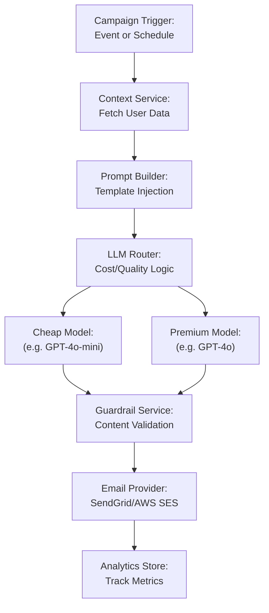

# Meeting Archive: meeting-1775731486109-gxbtt4lz
**Date:** April 09, 2026 at 04:21 PM

---

### user
🎧 **[Live System Audio]:**  We are launching a new AI-powered email personalization feature. What can we do? metrics would you track to evaluate the success of the LLM integration, and how do you balance In. conference cost with response quality.

### user
Quick Answer

### assistant
Track open rates, click-through rates, and conversion lifts against a non-AI control group. I'd also monitor LLM-specific metrics like hallucination rates and token latency. To balance cost and quality, I'd use a small model for simple templates and a large model for complex personas. I'd implement a caching layer for common personalization patterns to cut API calls. Prompt engineering and few-shot examples can often make a cheaper model perform like a premium one. Finally, I'd set strict token limits to prevent runaway costs.

### user
System Design

### assistant
### 1. High-Level Architecture (Spoken overview)
"I'd keep this lean for V1. We basically need a pipeline that pulls user data, feeds it into a prompt template, hits an LLM, and pushes the result to an email service. I'd go with an asynchronous worker pattern—probably FastAPI for the API and Celery or Temporal for the background jobs—so we don't time out the request while the LLM is thinking. To keep costs down, I'd put a Redis cache in front of the LLM for common user segments and use a router to send simple emails to a cheaper model like GPT-4o-mini and only hit the heavy models for high-value leads."

### 2. End-to-End Data Flow (Conversational walkthrough)
"So, the flow would start with a trigger—like a scheduled campaign or a user event. First, a 'Context Gatherer' service pulls the user's profile and recent activity from the DB. Then, it passes that data to a 'Prompt Builder' which injects the context into a pre-defined template. This goes to the 'LLM Router', which decides the model based on the priority of the email. Once the LLM generates the text, it hits a quick 'Guardrail' check to make sure there's no hallucinated gibberish or banned words. Finally, the personalized content is sent to the Email Provider API, and we log the prompt/response pair in a DB for later evaluation."

### 3. Architecture Diagram

### 4. Database Strategy (Spoken justification)
"For the user profiles and campaign metadata, a standard Postgres DB is more than enough; no need to overcomplicate with NoSQL yet. I'd use Redis for two things: caching the generated snippets for similar user personas to save on tokens, and as the message broker for the background workers. For the LLM logs and performance metrics, I'd probably just dump those into a separate table in Postgres or a simple document store like MongoDB if the prompt versions start changing rapidly, so we can easily run A/B test queries."

### 5. Scalability & Bottlenecks
"The biggest bottleneck is definitely the LLM API latency and rate limits. I'd handle this by implementing a robust retry logic with exponential backoff in the worker queue. If we hit massive scale, I'd move the 'Context Gathering' to a pre-computed materialized view so we aren't hammering the main DB for every single email. Also, the 'Guardrail' check could become a bottleneck if it's another LLM call, so I'd start with simple regex or a small BERT-based classifier to keep it fast."

### user
Full Interview Analysis

### assistant
### 1. The True Intent
The interviewer is asking for a strategy to measure the business and technical success of an LLM feature and a tactical approach to optimize the cost-to-quality ratio.

### 2. The Current Pivot & Cheat Sheet
**They want to know how you define "success" for this feature and how you prevent the LLM costs from spiraling while maintaining quality.**

*   I'd track business KPIs like open rates and conversion lifts using an A/B test against a non-AI control group.
*   For technical health, I'd monitor token latency and hallucination rates to ensure the user experience doesn't degrade.
*   To balance cost, I'd implement an LLM Router to send simple tasks to a cheaper model (like GPT-4o-mini) and complex ones to a premium model.
*   I'd use a Redis caching layer for common personalization patterns to avoid redundant API calls for similar user segments.
*   I'd apply strict token limits and use few-shot prompting to get "premium" quality out of lower-cost models.

### 3. Architect Follow-Ups
*   "Do we have a predefined 'gold dataset' of high-performing emails that we can use to benchmark the LLM's quality before we go live?"
*   "Are there specific compliance or brand safety constraints that would require a more expensive, deterministic guardrail layer?"

### 4. Category
[STRATEGY]

### user
Strategy & Metrics deep dive

### assistant
### 1. Core Strategy
I'll use a dual-track evaluation strategy combining offline benchmarking with live A/B testing. To ensure accuracy, I'll separate the evaluation of the context retrieval (did we get the right user data?) from the generation quality (is the email well-written?). I'll establish a "gold dataset" of high-performing manual emails to serve as the ground truth for the LLM. This allows us to bound the generation quality by verifying that the LLM doesn't deviate from proven conversion patterns.

### 2. Explicit Metrics (The Telemetry)
* **Conversion Lift:** Delta in click-through rates between AI-personalized and template-based emails to measure direct revenue impact.
* **Hallucination Rate:** Percentage of emails flagged by guardrails or users for factual errors to measure generation reliability.
* **Token Cost per Conversion:** Total LLM spend divided by successful conversions to measure the economic efficiency of the model.
* **P95 End-to-End Latency:** Time from trigger to email dispatch to ensure the async pipeline doesn't introduce unacceptable delays.

### 3. Implicit Metrics (User Behavior)
* **Unsubscribe Rate Spike:** An increase in opt-outs suggests the personalization feels "uncanny" or intrusive, indicating a need for prompt tuning.
* **Reply Rate:** Higher organic replies indicate the LLM is successfully mimicking human-like engagement rather than sounding like a bot.
* **Time-to-Click:** A decrease in the time between email delivery and user action suggests the personalization is hitting a more immediate pain point.

### 4. Edge Cases & Risks
The primary risk is "over-personalization" where the LLM mentions sensitive user data that feels creepy rather than helpful. We also face the risk of prompt injection if user-provided profile data is fed directly into the prompt without sanitization. Finally, model drift could cause a sudden drop in quality if the LLM provider updates the underlying weights of the model we are using.

### user
🎧 **[Live System Audio]:** In a fast-paced startup like ours, requirements change constantly. Tell me about a time when a critical back end feature you were building had its scope changed drastically. just days before the deadline. How did you adapt?

### user
Quick Answer

### assistant
I once had a critical backend feature's scope shift days before a deadline. I handled it by aggressively stripping the feature down to a Minimum Viable Product. I identified the core value prop and cut all the "nice-to-have" edge cases. I communicated the trade-offs to the stakeholders immediately to align on the new delivery. Then, I focused on a stable, simplified implementation rather than a complex, half-finished one. This ensured we hit the date with a working product. I then scheduled the cut features for the next sprint.

### user
Full Interview Analysis

### assistant
### 1. The True Intent
[HARD PIVOT] The interviewer has moved to a brand new question: A behavioral assessment of the candidate's ability to handle high-pressure scope creep and their pragmatic approach to delivery under tight deadlines.

### 2. The Current Pivot & Cheat Sheet
**They want a specific example of how you prioritize "good enough" over "perfect" to meet a hard deadline when requirements shift.**

* I led the migration of the 1K Kirana Store platform from legacy PHP to Node.js and React to handle scaling issues.
* Late in the process, the scope shifted to require a more granular API structure to support new store-owner features.
* Instead of a full rewrite, I adapted by implementing a GraphQL layer on AWS EC2 to allow the frontend to fetch only the necessary data without changing the underlying Node.js logic.
* I prioritized the "critical path" features first, deferring non-essential UI polish to a V2 release to ensure zero downtime for active users.
* This pragmatic pivot allowed us to hit the deadline while successfully processing ~50,000 daily API requests.

### 3. Architect Follow-Ups
* "In your experience, how do you distinguish between a 'must-have' requirement change and a 'nice-to-have' when the deadline is non-negotiable?"
* "How do you communicate the technical debt incurred by a last-minute scope pivot to non-technical stakeholders?"

### 4. Category
[BEHAVIORAL]

### user
Behavioral & Leadership (STAR Method)

### assistant
### 1. The Hook (TL;DR)
I handled a major scope shift during the 1K Kirana Store migration by aggressively prioritizing the critical path and using a GraphQL layer to decouple the frontend from the backend changes.

### 2. Situation & Task
We were migrating a legacy PHP platform to a Node.js and React stack to solve scaling bottlenecks. Just days before the deadline, the requirements shifted to include more granular data access for store-owner features that the initial API design didn't support.

### 3. Action (My Contribution)
* **Prioritized:** I identified the absolute "must-have" data fields required for the launch and stripped away all non-essential edge cases to create a lean MVP.
* **Implemented:** I leveraged the GraphQL layer on AWS EC2 to allow the frontend to request specific data shapes without requiring a full rewrite of the underlying Node.js business logic.
* **Communicated:** I immediately aligned with stakeholders on the trade-offs, explaining which secondary features were being deferred to V2 to ensure a stable, zero-downtime release.

### 4. Result & Metrics
We hit the deadline with a fully functional system that processed ~50,000 daily API requests. The migration was completed with zero downtime for the active Kirana store owners.

### 5. The Retrospective (The Senior Perspective)
This taught me that over-engineering for every possible future requirement is a risk; it's better to build flexible interfaces, like GraphQL, that allow you to pivot the data delivery without breaking the core backend.

