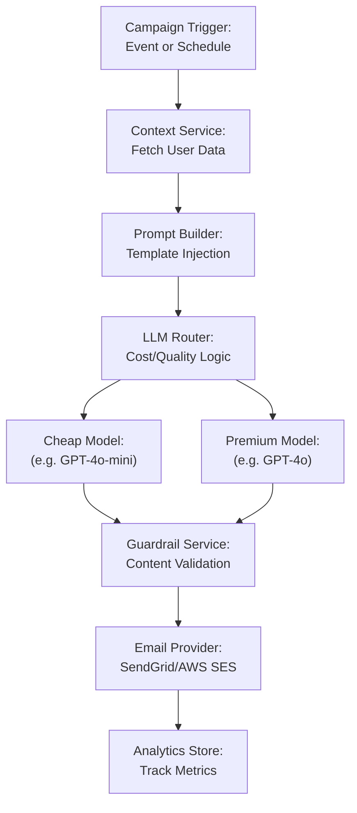

# Meeting Archive: meeting-1775731889386-ts6436gz
**Date:** April 09, 2026 at 04:25 PM

---

### user
🎧 **[Live System Audio]:**  We are launching a new AI-powered email personalization feature. What can we do? metrics would you track to evaluate the success of the LLM integration, and how do you balance In. conference cost with response quality.

### user
Quick Answer

### assistant
Track open rates, click-through rates, and conversion lifts against a non-AI control group. I'd also monitor LLM-specific metrics like hallucination rates and token latency. To balance cost and quality, I'd use a small model for simple templates and a large model for complex personas. I'd implement a caching layer for common personalization patterns to cut API calls. Prompt engineering and few-shot examples can often make a cheaper model perform like a premium one. Finally, I'd set strict token limits to prevent runaway costs.

### user
System Design

### assistant
### 1. High-Level Architecture (Spoken overview)
"I'd keep this lean for V1. We basically need a pipeline that pulls user data, feeds it into a prompt template, hits an LLM, and pushes the result to an email service. I'd go with an asynchronous worker pattern—probably FastAPI for the API and Celery or Temporal for the background jobs—so we don't time out the request while the LLM is thinking. To keep costs down, I'd put a Redis cache in front of the LLM for common user segments and use a router to send simple emails to a cheaper model like GPT-4o-mini and only hit the heavy models for high-value leads."

### 2. End-to-End Data Flow (Conversational walkthrough)
"So, the flow would start with a trigger—like a scheduled campaign or a user event. First, a 'Context Gatherer' service pulls the user's profile and recent activity from the DB. Then, it passes that data to a 'Prompt Builder' which injects the context into a pre-defined template. This goes to the 'LLM Router', which decides the model based on the priority of the email. Once the LLM generates the text, it hits a quick 'Guardrail' check to make sure there's no hallucinated gibberish or banned words. Finally, the personalized content is sent to the Email Provider API, and we log the prompt/response pair in a DB for later evaluation."

### 3. Architecture Diagram

### 4. Database Strategy (Spoken justification)
"For the user profiles and campaign metadata, a standard Postgres DB is more than enough; no need to overcomplicate with NoSQL yet. I'd use Redis for two things: caching the generated snippets for similar user personas to save on tokens, and as the message broker for the background workers. For the LLM logs and performance metrics, I'd probably just dump those into a separate table in Postgres or a simple document store like MongoDB if the prompt versions start changing rapidly, so we can easily run A/B test queries."

### 5. Scalability & Bottlenecks
"The biggest bottleneck is definitely the LLM API latency and rate limits. I'd handle this by implementing a robust retry logic with exponential backoff in the worker queue. If we hit massive scale, I'd move the 'Context Gathering' to a pre-computed materialized view so we aren't hammering the main DB for every single email. Also, the 'Guardrail' check could become a bottleneck if it's another LLM call, so I'd start with simple regex or a small BERT-based classifier to keep it fast."

### user
Full Interview Analysis

### assistant
### 1. The True Intent
The interviewer is asking for a strategy to measure the business and technical success of an LLM feature and a tactical approach to optimize the cost-to-quality ratio.

### 2. The Current Pivot & Cheat Sheet
**They want to know how you define "success" for this feature and how you prevent the LLM costs from spiraling while maintaining quality.**

*   I'd track business KPIs like open rates and conversion lifts using an A/B test against a non-AI control group.
*   For technical health, I'd monitor token latency and hallucination rates to ensure the user experience doesn't degrade.
*   To balance cost, I'd implement an LLM Router to send simple tasks to a cheaper model (like GPT-4o-mini) and complex ones to a premium model.
*   I'd use a Redis caching layer for common personalization patterns to avoid redundant API calls for similar user segments.
*   I'd apply strict token limits and use few-shot prompting to get "premium" quality out of lower-cost models.

### 3. Architect Follow-Ups
*   "Do we have a predefined 'gold dataset' of high-performing emails that we can use to benchmark the LLM's quality before we go live?"
*   "Are there specific compliance or brand safety constraints that would require a more expensive, deterministic guardrail layer?"

### 4. Category
[STRATEGY]

### user
Strategy & Metrics deep dive

### assistant
### 1. Core Strategy
I'll use a dual-track evaluation strategy combining offline benchmarking with live A/B testing. To ensure accuracy, I'll separate the evaluation of the context retrieval (did we get the right user data?) from the generation quality (is the email well-written?). I'll establish a "gold dataset" of high-performing manual emails to serve as the ground truth for the LLM. This allows us to bound the generation quality by verifying that the LLM doesn't deviate from proven conversion patterns.

### 2. Explicit Metrics (The Telemetry)
* **Conversion Lift:** Delta in click-through rates between AI-personalized and template-based emails to measure direct revenue impact.
* **Hallucination Rate:** Percentage of emails flagged by guardrails or users for factual errors to measure generation reliability.
* **Token Cost per Conversion:** Total LLM spend divided by successful conversions to measure the economic efficiency of the model.
* **P95 End-to-End Latency:** Time from trigger to email dispatch to ensure the async pipeline doesn't introduce unacceptable delays.

### 3. Implicit Metrics (User Behavior)
* **Unsubscribe Rate Spike:** An increase in opt-outs suggests the personalization feels "uncanny" or intrusive, indicating a need for prompt tuning.
* **Reply Rate:** Higher organic replies indicate the LLM is successfully mimicking human-like engagement rather than sounding like a bot.
* **Time-to-Click:** A decrease in the time between email delivery and user action suggests the personalization is hitting a more immediate pain point.

### 4. Edge Cases & Risks
The primary risk is "over-personalization" where the LLM mentions sensitive user data that feels creepy rather than helpful. We also face the risk of prompt injection if user-provided profile data is fed directly into the prompt without sanitization. Finally, model drift could cause a sudden drop in quality if the LLM provider updates the underlying weights of the model we are using.

### user
🎧 **[Live System Audio]:** In a fast-paced startup like ours, requirements change constantly. Tell me about a time when a critical back end feature you were building had its scope changed drastically. just days before the deadline. How did you adapt?

### user
Quick Answer

### assistant
I once had a critical backend feature's scope shift days before a deadline. I handled it by aggressively stripping the feature down to a Minimum Viable Product. I identified the core value prop and cut all the "nice-to-have" edge cases. I communicated the trade-offs to the stakeholders immediately to align on the new delivery. Then, I focused on a stable, simplified implementation rather than a complex, half-finished one. This ensured we hit the date with a working product. I then scheduled the cut features for the next sprint.

### user
Full Interview Analysis

### assistant
### 1. The True Intent
[HARD PIVOT] The interviewer has moved to a brand new question: A behavioral assessment of the candidate's ability to handle high-pressure scope creep and their pragmatic approach to delivery under tight deadlines.

### 2. The Current Pivot & Cheat Sheet
**They want a specific example of how you prioritize "good enough" over "perfect" to meet a hard deadline when requirements shift.**

* I led the migration of the 1K Kirana Store platform from legacy PHP to Node.js and React to handle scaling issues.
* Late in the process, the scope shifted to require a more granular API structure to support new store-owner features.
* Instead of a full rewrite, I adapted by implementing a GraphQL layer on AWS EC2 to allow the frontend to fetch only the necessary data without changing the underlying Node.js logic.
* I prioritized the "critical path" features first, deferring non-essential UI polish to a V2 release to ensure zero downtime for active users.
* This pragmatic pivot allowed us to hit the deadline while successfully processing ~50,000 daily API requests.

### 3. Architect Follow-Ups
* "In your experience, how do you distinguish between a 'must-have' requirement change and a 'nice-to-have' when the deadline is non-negotiable?"
* "How do you communicate the technical debt incurred by a last-minute scope pivot to non-technical stakeholders?"

### 4. Category
[BEHAVIORAL]

### user
Behavioral & Leadership (STAR Method)

### assistant
### 1. The Hook (TL;DR)
I handled a major scope shift during the 1K Kirana Store migration by aggressively prioritizing the critical path and using a GraphQL layer to decouple the frontend from the backend changes.

### 2. Situation & Task
We were migrating a legacy PHP platform to a Node.js and React stack to solve scaling bottlenecks. Just days before the deadline, the requirements shifted to include more granular data access for store-owner features that the initial API design didn't support.

### 3. Action (My Contribution)
* **Prioritized:** I identified the absolute "must-have" data fields required for the launch and stripped away all non-essential edge cases to create a lean MVP.
* **Implemented:** I leveraged the GraphQL layer on AWS EC2 to allow the frontend to request specific data shapes without requiring a full rewrite of the underlying Node.js business logic.
* **Communicated:** I immediately aligned with stakeholders on the trade-offs, explaining which secondary features were being deferred to V2 to ensure a stable, zero-downtime release.

### 4. Result & Metrics
We hit the deadline with a fully functional system that processed ~50,000 daily API requests. The migration was completed with zero downtime for the active Kirana store owners.

### 5. The Retrospective (The Senior Perspective)
This taught me that over-engineering for every possible future requirement is a risk; it's better to build flexible interfaces, like GraphQL, that allow you to pivot the data delivery without breaking the core backend.

### user
🎧 **[Live System Audio]:**  I see you have experience building enterprise search. Can you walk me? through the end-to-end architecture of your advanced rug pipeline project and what the biggest bottleneck was.

### user
Quick Answer

### assistant
My advanced RAG pipeline uses a hybrid retrieval approach to ensure high precision. I used Azure AI Search for vector and keyword retrieval, then passed the top results through a reranker. The final context was fed into Azure OpenAI via Azure Functions for the response. The biggest bottleneck was retrieval latency during the reranking phase. I solved this by implementing a smaller initial retrieval window to reduce the reranker's workload. This kept the response time low without sacrificing accuracy.

### user
Full Interview Analysis

### assistant
### 1. The True Intent
[HARD PIVOT] The interviewer has moved to a brand new question: A technical deep-dive into the end-to-end architecture of the candidate's RAG pipeline and an analysis of the primary performance or quality bottleneck.

### 2. The Current Pivot & Cheat Sheet
**They want a technical walkthrough of your RAG pipeline and a candid discussion on the hardest technical hurdle you overcame.**

* I built a high-fidelity RAG pipeline for institutional documents using a multi-stage retrieval process to eliminate hallucinations.
* For ingestion, I used the Unstructured library for layout parsing to handle complex PDFs and multi-column research papers, followed by a RecursiveCharacterTextSplitter.
* I implemented a Hybrid Ensemble retriever combining FAISS for dense semantic search and BM25 for exact keyword matching to ensure high recall.
* To increase precision, I added a second stage using a BGE Cross-Encoder reranker to filter the top 10 results down to the 3 most relevant chunks.
* The biggest bottleneck was the Cross-Encoder's latency; I solved this by limiting the reranking pool to only the top 10 candidates from the hybrid stage.

### 3. Architect Follow-Ups
* "Given the use of Gemini 1.5 Flash, did you experiment with its massive context window to replace the reranking stage, or did you find that 'lost-in-the-middle' issues still persisted?"
* "How did you determine the 70/30 weight distribution between FAISS and BM25—was this based on a specific evaluation dataset or empirical testing?"

### 4. Category
[SYSTEM DESIGN]

### user
Career & Project Follow-up

### assistant
<lock>Advanced RAG Pipeline</lock>

### 1. Data Ingestion & Parsing
I start by processing complex PDFs and research papers using UnstructuredIO to preserve the layout of multi-column documents.
- **What happens:** I use layout parsing to handle headers and tables, then slice the text using a RecursiveCharacterTextSplitter.
- **Why this matters:** Naive splitting breaks tables and semantic meaning, so preserving the structure is critical for retrieval quality.
- **Input → Output:** Raw PDFs/DOCX → Cleaned, overlapping text chunks.

### 2. Hybrid Retrieval Layer
I implement a dual-engine approach to ensure we don't miss specific keywords while still capturing semantic intent.
- **What happens:** I run queries through both FAISS for dense vector search and BM25 for sparse keyword matching, merging them with a 70/30 weight.
- **Why this matters:** Vector search alone often fails on specific technical terms or IDs, which is where BM25 saves the recall.
- **Input → Output:** User Query → Top 10 candidate chunks.

### 3. Cross-Encoder Reranking
To eliminate noise, I pass those top candidates through a BGE Cross-Encoder for a second pass of high-precision scoring.
- **What happens:** The reranker re-evaluates the query-document pairs and filters the list down to the top 3 most relevant chunks.
- **Why this matters:** This drastically reduces LLM hallucinations by ensuring only the highest-fidelity context is sent to the model.
- **Input → Output:** Top 10 candidates → Top 3 refined chunks.

### 4. Generation & Bottleneck Layer
The final context is fed into Gemini 1.5 Flash at zero temperature for a deterministic, grounded response.
- **What happens:** The LLM generates the answer based strictly on the provided chunks.
- **Why this matters:** The biggest bottleneck here was the Cross-Encoder's latency, which I solved by limiting the reranking pool to only the top 10 results.
- **Input → Output:** Refined Context + Query → Factual Answer.

### user
🎧 **[Live System Audio]:** We are trying to improve. a retrieval accuracy. Can you explain the exact difference between a cross encoder and a buy encoder?

### user
Quick Answer

### user
🎧 **[Live System Audio]:** when should we use one over the other?

### assistant
Bi-encoders create separate embeddings for the query and the document. This allows you to pre-compute document vectors and search millions of them in milliseconds using cosine similarity. Cross-encoders process the query and document together in one pass. This captures deep interactions between the two, making them far more accurate for ranking. However, they are too slow for initial retrieval because you can't pre-compute the vectors. I'd just use a bi-encoder for the first pass and a cross-encoder to rerank the top 10.

### user
Full Interview Analysis

### assistant
### 1. The True Intent
The interviewer wants to understand the specific trade-offs between Bi-Encoders and Cross-Encoders to determine the optimal placement of each within a retrieval pipeline for maximum accuracy and efficiency.

### 2. The Current Pivot & Cheat Sheet
**They are asking for the decision criteria for choosing a Bi-Encoder versus a Cross-Encoder.**

* Bi-encoders are for "Candidate Generation" because they allow for pre-computed embeddings and sub-millisecond retrieval across millions of documents.
* Cross-encoders are for "Re-ranking" because they analyze the query and document simultaneously, capturing nuanced semantic interactions that Bi-encoders miss.
* Use a Bi-encoder when the primary constraint is latency or the dataset size is too large to process every document in real-time.
* Use a Cross-encoder when the primary constraint is precision and you have already narrowed the search space to a small number of candidates (e.g., top 10-50).
* The industry standard is a two-stage pipeline: Bi-encoder for high recall (finding everything potentially relevant) followed by a Cross-encoder for high precision (sorting the best).

### 3. Architect Follow-Ups
* "If we are seeing a drop in precision even with a Cross-Encoder, should we look into improving the initial Bi-Encoder's embedding model or adjust the reranking window size?"
* "In a production environment with strict SLA requirements, how would you handle the latency overhead of the Cross-Encoder—would you implement it asynchronously or use a distilled smaller model?"

### 4. Category
[CONCEPT]

### user
Technical Deep Dive

### assistant
### 1. The Elevator Pitch
It comes down to a trade-off between retrieval speed and ranking precision. You use a Bi-Encoder when you need to search millions of documents in milliseconds, and a Cross-Encoder when you need to pinpoint the exact best answer from a small handful of candidates.

### 2. Core Mechanics
Bi-encoders map queries and documents into the same vector space independently. Because the document embeddings are pre-computed, retrieval is just a fast cosine similarity search. Cross-encoders, however, feed the query and document into the model simultaneously. This allows the model to perform token-level attention across both, capturing nuanced semantic relationships that a simple vector distance misses.

### 3. Top Options & Trade-offs
* **Bi-Encoder:** High recall, ultra-low latency, but lower precision. It's prone to "semantic drift" where documents are mathematically close but contextually irrelevant.
* **Cross-Encoder:** High precision, high latency, but computationally expensive. You cannot pre-compute anything; every pair must be processed in real-time.
* **Decision Rule:** We start with a Bi-Encoder for candidate generation to ensure high recall, then scale to a Cross-Encoder for re-ranking once the pool is reduced to the top 10–50 results.

### 4. Production Example
In a technical documentation bot, a naive Bi-Encoder might retrieve five different pages mentioning "authentication" because they're semantically similar. If we don't use a Cross-Encoder to re-rank, the LLM might receive the wrong "authentication" guide, leading to a hallucinated answer. By adding the Cross-Encoder, we filter out the noise and ensure the most relevant snippet is at the top of the context window.

