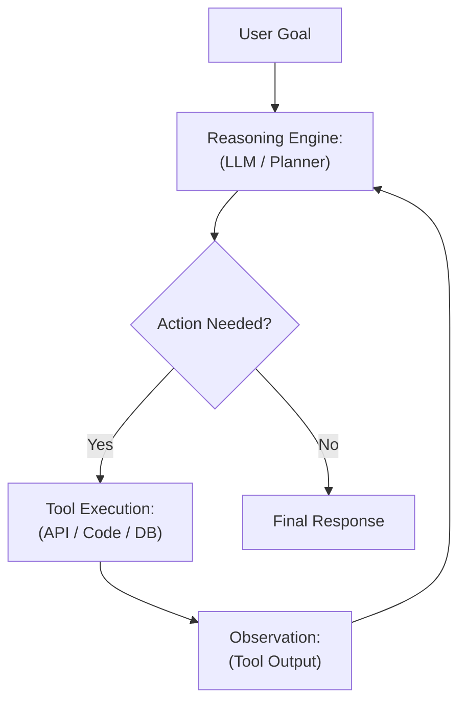

# Meeting Archive: meeting-1775931451741-xbu64syv
**Date:** April 11, 2026 at 11:47 PM

---

### user
hi

### assistant
Out of scope. I only assist with software engineering.

### user
how do agents works

### assistant
Agents are essentially LLMs wrapped in a control loop that allows them to reason, use tools, and observe the results of their actions to reach a goal. Instead of a single prompt-response, an agent operates in a cycle: Plan $\rightarrow$ Act $\rightarrow$ Observe $\rightarrow$ Repeat.

The core components are:
- **Brain (LLM):** The reasoning engine that decides which action to take based on the goal and current state.
- **Planning:** The agent breaks down a complex goal into smaller steps (e.g., using Chain-of-Thought or ReAct patterns).
- **Tools (Capabilities):** External functions the LLM can call (APIs, database queries, web search, code interpreters).
- **Memory:** Short-term memory (context window/chat history) and long-term memory (Vector DBs for RAG).

Common implementation patterns:
- **ReAct (Reason + Act):** The agent writes a "Thought," then an "Action," then reads an "Observation."
- **Agentic Workflows (LangGraph):** Moving away from autonomous "black box" agents toward structured graphs where state transitions are explicitly defined to prevent infinite loops and hallucinations.
- **Multi-Agent Systems:** Splitting tasks between specialized agents (e.g., one "Researcher" agent and one "Writer" agent) to improve accuracy and reduce context noise.

### user
🎧 **[Live System Audio]:** 

