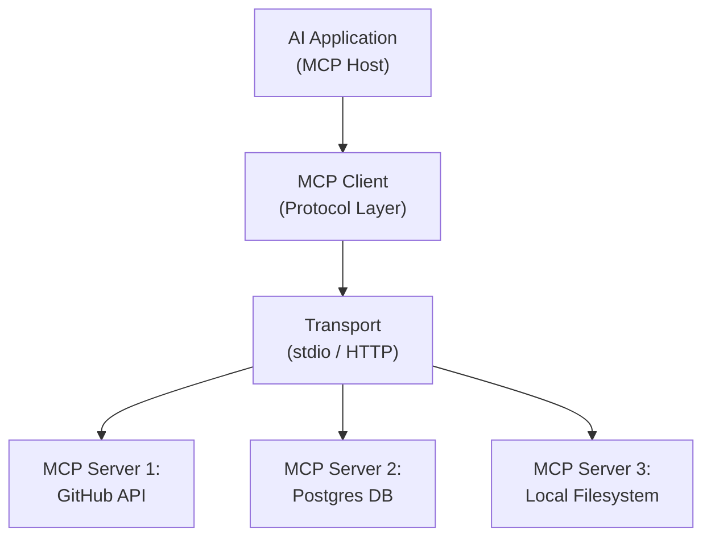

# Meeting Archive: meeting-1775931982457-1r0wrttd
**Date:** April 11, 2026 at 11:56 PM

---

### user
what is mcp

### assistant
Model Context Protocol (MCP) is an open standard designed to decouple the AI application (the client) from the data sources and tools (the servers). Instead of writing custom integrations for every single tool or database for every different LLM, MCP provides a universal interface.

Essentially, it turns data sources into "pluggable" services that any MCP-compliant AI client can discover and use without needing a bespoke API wrapper for each one.

**Core Components:**
*   **MCP Hosts:** The AI application (e.g., Claude Desktop, an IDE) that initiates the connection and manages the LLM's interaction with the server.
*   **MCP Servers:** Small, lightweight services that expose specific capabilities (e.g., a GitHub repo reader, a Postgres query tool, or a local filesystem browser).
*   **Transport Layer:** Usually JSON-RPC over stdio or HTTP/SSE, allowing the host and server to communicate.

**Why it matters for execution:**
It eliminates the "integration tax." Instead of building a custom RAG pipeline or tool-calling logic for every new data source, you deploy an MCP server once, and any compatible agent can immediately use those tools.

### user
🎧 **[Live System Audio]:** 

