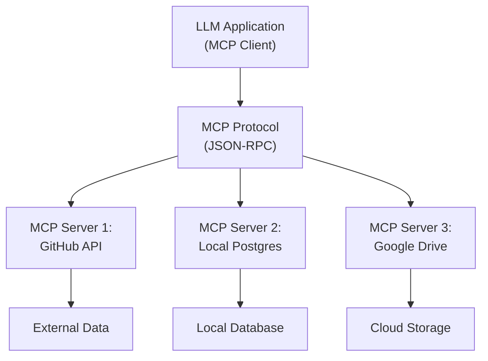

# Meeting Archive: meeting-1775934720052-49rwpdr2
**Date:** April 12, 2026 at 12:45 AM

---

### user
hi

### assistant
Out of scope. I only assist with software engineering.

### user
what is mco

### assistant
Out of scope. I only assist with software engineering.

### user
what is mcp

### assistant
MCP can mean different things in tech.  
- **Microservice Control Plane** – a lightweight orchestration layer that manages service discovery, routing, and configuration for a micro‑service fleet.  
- **MCP‑1 (Molecular Clustering Protocol)** – a protocol used in bioinformatics for clustering sequence data.  
- **Microsoft Certified Professional** – a certification program.  

If you had a specific domain in mind, let me know.

### user
what is mcp

### assistant
Assuming you're referring to the **Model Context Protocol (MCP)** recently introduced by Anthropic:

It's an open standard designed to solve the "siloed data" problem for LLMs. Instead of writing a custom integration for every single tool (GitHub, Slack, Postgres, Local Files) for every different LLM client, MCP provides a universal interface.

Essentially, it decouples the **LLM Application** (the client) from the **Data Source** (the server).

**How it works:**
- **MCP Server:** A small service that exposes specific tools, resources, or prompts (e.g., a server that can read your local SQLite DB).
- **MCP Client:** An LLM-powered app (like Claude Desktop or a custom IDE) that connects to these servers.
- **Protocol:** A standardized JSON-RPC based communication layer.

**Why it matters:**
You write the connector once as an MCP server, and any MCP-compliant client can immediately use those tools without you rewriting the glue code for every new model or platform.

### user
🎧 **[Live System Audio]:**  Our new multi-agent support system is working, but it's racking up. massive LLM AP bills and latency is taking almost 15 seconds per request because of the quality of the final output.

### user
Quick Answer

### assistant
**The Question:** How to reduce high LLM costs and 15s latency in a multi-agent system without sacrificing output quality.

* Looks like you're over-relying on frontier models for every step; I'd implement a "Router" pattern using a small, fast model (like GPT-4o-mini or Haiku) to handle simple tasks.
* I'd move from a sequential chain to a "Supervisor/Worker" architecture to parallelize agent tasks and reduce the total time-to-first-token.
* To cut costs, I'd implement strict Pydantic schema validation to stop "hallucination loops" and set a hard max recursion depth for the agents.
* I'd check if we can replace some agentic reasoning with standard RAG for known data, treating retrieval as a tool rather than a conversation.
* Are you currently using a single large model for all agents, or do you have a mix of model sizes?

### user
Full Interview Analysis

### assistant
### 1. The Interviewer's Question
"Our new multi-agent support system is working, but it's racking up massive LLM API bills and latency is taking almost 15 seconds per request because of the quality of the final output."

### 2. The True Intent
The interviewer is asking for a strategy to optimize an existing agentic workflow to reduce operational costs and response latency while maintaining high output quality.

### 3. Technical Deep Dive
**Router Pattern.** The system utilizes a lightweight, high-speed model (such as GPT-4o-mini or Claude Haiku) as a gateway to classify incoming requests. By routing simple queries to smaller models and reserving frontier models only for complex reasoning, the system significantly reduces token spend and initial latency.

**Supervisor/Worker Architecture.** Instead of a sequential chain where each agent must finish before the next begins, a supervisor agent orchestrates multiple worker agents in parallel. This reduces the critical path of the request, allowing the system to gather multiple pieces of information simultaneously and decreasing the total time-to-first-token.

**Pydantic Schema Validation.** To prevent "hallucination loops"—where agents repeatedly fail and retry due to malformed outputs—the system enforces strict structural constraints using Pydantic. By validating the output format at each step and implementing a hard max recursion depth, the system avoids infinite loops that spike both cost and latency.

**RAG as a Tool.** Rather than allowing an agent to "reason" through a large context window to find a fact, the system implements standard Retrieval-Augmented Generation (RAG). By treating data retrieval as a discrete tool call, the LLM only processes the most relevant snippets, reducing input token costs and improving the precision of the final answer.

### 4. Architect Follow-Ups
* Are you currently using a single frontier model for all agents in the chain, or is there already a mix of model sizes being utilized?
* Is the 15-second latency primarily driven by the number of sequential LLM calls, or is it caused by slow external tool execution and data retrieval?

### 5. Category
[STRATEGY]

### user
Strategy & Metrics deep dive

### assistant
### 1. Core Strategy
I'll implement a Router pattern using a small model to divert simple queries away from expensive frontier models. To kill the 15s latency, I'll shift from sequential agent chains to a parallel Supervisor/Worker architecture. I'll enforce strict Pydantic schemas to eliminate costly hallucination loops and redundant retries. Finally, I'll replace agentic reasoning for data retrieval with a standard RAG tool to minimize input token overhead.

### 2. Explicit Metrics (The Telemetry)
* **Tokens per Request:** tracks average input/output volume to identify which agents are bloating the bill.
* **P95 End-to-End Latency:** measures the tail latency to ensure parallelization is actually reducing the 15s bottleneck.
* **Model Routing Ratio:** percentage of requests handled by small vs. large models to validate cost-saving shifts.
* **Agent Loop Count:** number of iterations per request to detect and cap recursive "reasoning" loops.

### 3. Implicit Metrics (User Behavior)
* **Correction Rate:** users asking the agent to "try again" indicates the smaller model is failing quality checks.
* **Session Abandonment:** users dropping off before the 15s mark confirms latency is the primary churn driver.
* **Tool Call Frequency:** excessive tool calls for simple queries suggests the router is misclassifying intent.

### 4. Edge Cases & Risks
Routing simple queries to small models may lead to a slight dip in nuance for complex edge cases. Parallelizing agents increases the risk of conflicting outputs that the supervisor must then resolve, potentially adding a final latency hit. Aggressive token capping could truncate critical context needed for high-quality final answers.

