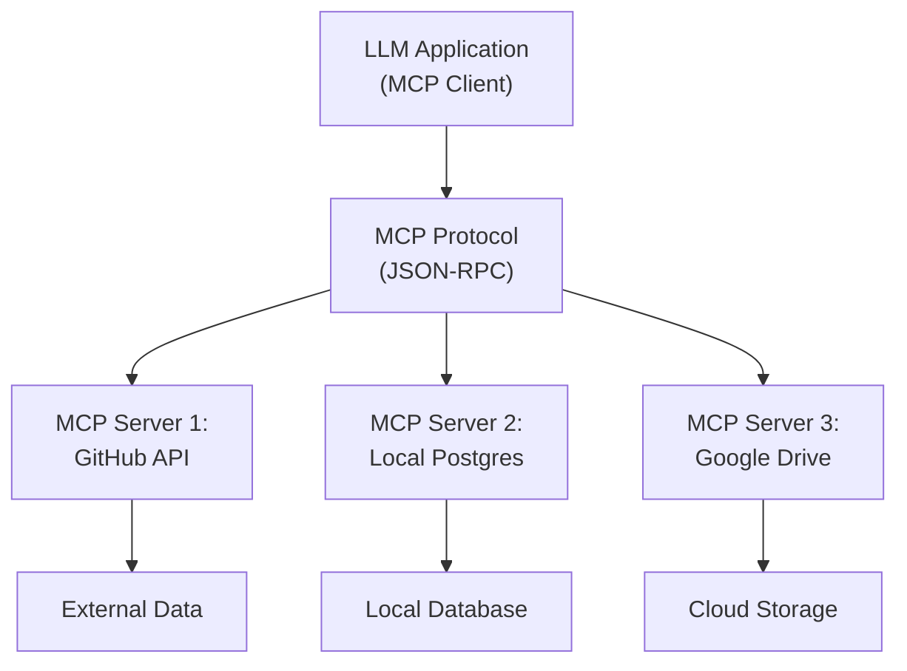

# Meeting Archive: meeting-1775935246285-ftkr92lt
**Date:** April 12, 2026 at 12:53 AM

---

### user
hi

### assistant
Out of scope. I only assist with software engineering.

### user
what is mco

### assistant
Out of scope. I only assist with software engineering.

### user
what is mcp

### assistant
MCP can mean different things in tech.  
- **Microservice Control Plane** – a lightweight orchestration layer that manages service discovery, routing, and configuration for a micro‑service fleet.  
- **MCP‑1 (Molecular Clustering Protocol)** – a protocol used in bioinformatics for clustering sequence data.  
- **Microsoft Certified Professional** – a certification program.  

If you had a specific domain in mind, let me know.

### user
what is mcp

### assistant
Assuming you're referring to the **Model Context Protocol (MCP)** recently introduced by Anthropic:

It's an open standard designed to solve the "siloed data" problem for LLMs. Instead of writing a custom integration for every single tool (GitHub, Slack, Postgres, Local Files) for every different LLM client, MCP provides a universal interface.

Essentially, it decouples the **LLM Application** (the client) from the **Data Source** (the server).

**How it works:**
- **MCP Server:** A small service that exposes specific tools, resources, or prompts (e.g., a server that can read your local SQLite DB).
- **MCP Client:** An LLM-powered app (like Claude Desktop or a custom IDE) that connects to these servers.
- **Protocol:** A standardized JSON-RPC based communication layer.

**Why it matters:**
You write the connector once as an MCP server, and any MCP-compliant client can immediately use those tools without you rewriting the glue code for every new model or platform.

### user
🎧 **[Live System Audio]:**  Our new multi-agent support system is working, but it's racking up. massive LLM AP bills and latency is taking almost 15 seconds per request because of the quality of the final output.

### user
Quick Answer

### assistant
**The Question:** How to reduce high LLM costs and 15s latency in a multi-agent system without sacrificing output quality.

* Looks like you're over-relying on frontier models for every step; I'd implement a "Router" pattern using a small, fast model (like GPT-4o-mini or Haiku) to handle simple tasks.
* I'd move from a sequential chain to a "Supervisor/Worker" architecture to parallelize agent tasks and reduce the total time-to-first-token.
* To cut costs, I'd implement strict Pydantic schema validation to stop "hallucination loops" and set a hard max recursion depth for the agents.
* I'd check if we can replace some agentic reasoning with standard RAG for known data, treating retrieval as a tool rather than a conversation.
* Are you currently using a single large model for all agents, or do you have a mix of model sizes?

### user
Full Interview Analysis

### assistant
### 1. The Interviewer's Question
"Our new multi-agent support system is working, but it's racking up massive LLM API bills and latency is taking almost 15 seconds per request because of the quality of the final output."

### 2. The True Intent
The interviewer is asking for a strategy to optimize an existing agentic workflow to reduce operational costs and response latency while maintaining high output quality.

### 3. Technical Deep Dive
**Router Pattern.** The system utilizes a lightweight, high-speed model (such as GPT-4o-mini or Claude Haiku) as a gateway to classify incoming requests. By routing simple queries to smaller models and reserving frontier models only for complex reasoning, the system significantly reduces token spend and initial latency.

**Supervisor/Worker Architecture.** Instead of a sequential chain where each agent must finish before the next begins, a supervisor agent orchestrates multiple worker agents in parallel. This reduces the critical path of the request, allowing the system to gather multiple pieces of information simultaneously and decreasing the total time-to-first-token.

**Pydantic Schema Validation.** To prevent "hallucination loops"—where agents repeatedly fail and retry due to malformed outputs—the system enforces strict structural constraints using Pydantic. By validating the output format at each step and implementing a hard max recursion depth, the system avoids infinite loops that spike both cost and latency.

**RAG as a Tool.** Rather than allowing an agent to "reason" through a large context window to find a fact, the system implements standard Retrieval-Augmented Generation (RAG). By treating data retrieval as a discrete tool call, the LLM only processes the most relevant snippets, reducing input token costs and improving the precision of the final answer.

### 4. Architect Follow-Ups
* Are you currently using a single frontier model for all agents in the chain, or is there already a mix of model sizes being utilized?
* Is the 15-second latency primarily driven by the number of sequential LLM calls, or is it caused by slow external tool execution and data retrieval?

### 5. Category
[STRATEGY]

### user
Strategy & Metrics deep dive

### assistant
### 1. Core Strategy
I'll implement a Router pattern using a small model to divert simple queries away from expensive frontier models. To kill the 15s latency, I'll shift from sequential agent chains to a parallel Supervisor/Worker architecture. I'll enforce strict Pydantic schemas to eliminate costly hallucination loops and redundant retries. Finally, I'll replace agentic reasoning for data retrieval with a standard RAG tool to minimize input token overhead.

### 2. Explicit Metrics (The Telemetry)
* **Tokens per Request:** tracks average input/output volume to identify which agents are bloating the bill.
* **P95 End-to-End Latency:** measures the tail latency to ensure parallelization is actually reducing the 15s bottleneck.
* **Model Routing Ratio:** percentage of requests handled by small vs. large models to validate cost-saving shifts.
* **Agent Loop Count:** number of iterations per request to detect and cap recursive "reasoning" loops.

### 3. Implicit Metrics (User Behavior)
* **Correction Rate:** users asking the agent to "try again" indicates the smaller model is failing quality checks.
* **Session Abandonment:** users dropping off before the 15s mark confirms latency is the primary churn driver.
* **Tool Call Frequency:** excessive tool calls for simple queries suggests the router is misclassifying intent.

### 4. Edge Cases & Risks
Routing simple queries to small models may lead to a slight dip in nuance for complex edge cases. Parallelizing agents increases the risk of conflicting outputs that the supervisor must then resolve, potentially adding a final latency hit. Aggressive token capping could truncate critical context needed for high-quality final answers.

### user
Strategy & Metrics deep dive

### assistant
**Intent:** OPTIMIZATION

### 1. Core Strategy Deep Dive
To tackle the 15-second latency and spiraling costs, my primary strategy is to move away from a "one-size-fits-all" frontier model approach and a sequential execution chain. I'll implement a **Router Pattern** using a lightweight model (like GPT-4o-mini or Claude Haiku) at the entry point. This router classifies the intent of the query; simple requests are handled entirely by the small model, while only complex, high-reasoning tasks are escalated to the frontier models. This immediately slashes the average cost per request and reduces the initial time-to-first-token for a significant portion of the traffic.

To solve the latency bottleneck, I'll replace the sequential agent chain with a **Supervisor/Worker Architecture**. In a sequential chain, the total latency is the sum of every LLM call; by moving to a supervisor model that can trigger multiple worker agents in parallel, we reduce the critical path to the duration of the slowest single worker call plus the final synthesis step. Furthermore, I'll optimize the "reasoning" phase by converting open-ended agentic searches into **Structured RAG Tools**. Instead of letting an agent "think" its way through a massive context window—which is slow and expensive—I'll provide a discrete tool that returns only the most relevant chunks, minimizing input token overhead and improving output precision.

Finally, to stop the "cost leaks" caused by agents getting stuck in reasoning loops, I'll implement **Strict Pydantic Schema Validation** and a hard recursion cap. By forcing agents to output structured JSON that is validated in real-time, we can catch malformed responses immediately and trigger a targeted retry or a fallback rather than allowing the agent to hallucinate through multiple expensive iterations.

### 2. Explicit Metrics (System Telemetry)
**P95 End-to-End Latency:** I will measure the time from the initial user request to the final response delivery. This tells us if our parallelization strategy is actually moving the needle on that 15s bottleneck; any spike above 8s would trigger an alert to investigate worker agent timeouts or supervisor synthesis delays.

**Model Routing Ratio:** This tracks the percentage of requests handled by the "Small" model versus the "Frontier" model. This is the primary indicator of cost-efficiency; if the ratio is too low (e.g., <30% small model), it indicates the router is too conservative and we are over-spending on simple queries.

**Average Tokens per Request (Input vs. Output):** By logging token counts per agent, we can identify "bloated" agents that are consuming excessive context. A sudden increase in input tokens usually signals a failure in the RAG retrieval bounds, triggering a review of the chunking strategy.

**Agent Iteration Count:** I'll track how many turns an agent takes before reaching a "final answer" state. A high average iteration count (e.g., >3 turns) indicates a "reasoning loop" or poor tool definitions, which directly correlates to increased latency and cost.

### 3. Implicit Metrics (User Behavior)
**Regeneration/Correction Rate:** I'll monitor how often users click "regenerate" or use phrases like "that's not what I meant." A spike here after implementing the Router pattern indicates that the smaller models are sacrificing too much quality, signaling a need to adjust the routing thresholds.

**Session Abandonment Rate:** I'll track the percentage of users who close the chat window before the LLM finishes generating. If abandonment peaks around the 10-15s mark, it confirms that latency is the primary driver of churn, regardless of the final output quality.

### 4. Edge Cases, Risks & Mitigations
**Risk of Routing Misclassification:** A complex query might be misclassified as "simple" and routed to a small model, resulting in a low-quality or incorrect answer. **Mitigation:** I'll implement a "Confidence Score" for the router; if the router is unsure, it defaults to the frontier model. Additionally, I'll implement a feedback loop where "regenerated" responses are automatically re-routed to the larger model.

**Risk of Conflicting Parallel Outputs:** In a Supervisor/Worker setup, two parallel agents might return contradictory information, leading to a confused final synthesis. **Mitigation:** I'll implement a "Conflict Resolution" prompt for the supervisor agent, specifically instructing it to identify contradictions and trigger a targeted "tie-breaker" call to a frontier model if the data is critical.

**Risk of Context Truncation:** Aggressive RAG filtering to save tokens might strip away the nuance required for high-quality final outputs. **Mitigation:** I'll use a "sliding window" retrieval approach or a re-ranking step (like Cohere Rerank) to ensure that while we reduce the total token count, we are keeping the highest-signal information.

### user
🎧 **[Live System Audio]:**  I see you've mentored a group of juniors. standard like agentic workflows or strict typing to a team that was resistant or struggling. How did you drive adaption?

### user
Quick Answer

### assistant
**The Question:** How do you lead a resistant team to adopt complex technical standards like agentic workflows and strict typing?

* I focus on "reducing friction" by building a gold-standard reference implementation first so they aren't guessing.
* For strict typing, I'd show them how Pydantic catches bugs at runtime before they hit production, making their on-call life easier.
* For agentic workflows, I'd start with a simple "Router" pattern to prove the value before moving to complex Supervisor/Worker setups.
* I'd implement "Pair Programming" sessions to handle the initial steep learning curve and clear blockers in real-time.
* Do you find your team struggles more with the conceptual shift of agents or the boilerplate of strict typing?

### user
Full Interview Analysis

### assistant
### 1. The Interviewer's Question
"I see you've mentored a group of juniors. How did you drive adoption of standards like agentic workflows or strict typing to a team that was resistant or struggling?"

### 2. The True Intent
[HARD PIVOT] The interviewer has moved to a brand new question: Evaluating leadership and mentorship capabilities, specifically the ability to drive technical adoption and upskill a resistant team.

### 3. Technical Deep Dive
**Gold-Standard Reference Implementations.** I focus on reducing friction by building a complete, working reference implementation first. By providing a "North Star" codebase, juniors aren't guessing at the implementation details; they can simply follow a proven pattern, which removes the cognitive load and anxiety associated with adopting new standards.

**Pydantic for Runtime Safety.** To drive adoption of strict typing, I demonstrate the immediate value of Pydantic by showing how it catches data validation bugs at the boundary before they reach production. I frame this not as "more boilerplate," but as a tool to make their on-call rotations easier and reduce the number of emergency hotfixes they have to write.

**Incremental Agentic Complexity.** I avoid overwhelming the team with complex architectures on day one. I start by implementing a simple Router pattern to prove the immediate value of intent classification, and only after the team is comfortable do I introduce more advanced Supervisor/Worker patterns or state-managed workflows.

**High-Bandwidth Pair Programming.** To flatten the learning curve, I implement structured pair programming sessions. This allows me to clear technical blockers in real-time and provide immediate feedback, transforming the adoption process from a theoretical requirement into a collaborative exercise.

### 4. Architect Follow-Ups
* When you encounter resistance to new standards, do you find it's usually due to a lack of conceptual understanding or a perceived increase in development overhead?
* How do you balance the need for strict architectural enforcement with the need to give junior developers the autonomy to experiment and learn?

### 5. Category
[BEHAVIORAL]

### user
Behavioral & Leadership (STAR Method)

### assistant
### 1. The Hook (TL;DR)
I drove adoption by shifting the conversation from "following rules" to "reducing on-call pain" through a gold-standard reference implementation.

### 2. Situation & Task
While scaling the engineering team for 1K Kirana Store, I noticed that a lack of standardization in the frontend was causing frequent production bugs and slowing down our feature delivery. My task was to upskill 4–5 junior developers and move them toward a modular, strictly typed architecture despite their initial resistance to the added boilerplate.

### 3. Action (My Contribution)
* **Built:** A gold-standard reference implementation of a modular component to serve as a "North Star," removing the guesswork for the juniors.
* **Demonstrated:** The immediate value of strict typing by showing how it caught runtime bugs during development rather than in production.
* **Implemented:** Structured pair programming sessions to clear technical blockers in real-time and transform the new standards into a collaborative effort.

### 4. Result & Metrics
We improved frontend reliability by approximately 20% and significantly reduced bug regressions. This shifted the junior developers into autonomous contributors, which accelerated our overall delivery velocity.

### 5. The Retrospective (The Senior Perspective)
This taught me that technical resistance is usually just a fear of friction; if you provide the reference code and prove the "quality of life" improvement, the team will adopt the standard on their own.

