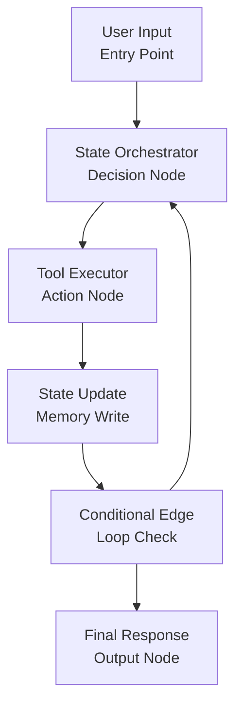

# Meeting Archive: meeting-1776172396024-m2jxzkav
**Date:** April 14, 2026 at 06:44 PM

---

### user
🎧 **[Live System Audio]:**  I don't know what it is, so if I ask you, right? There are so many things right, so there are so many frameworks in the market why you choose lang. graph instead of other frameworks and if not one of the other frameworks you have research about it. What is growth management? And let's design one agent architect.

### user
Quick Answer

### assistant
**The Question:** Why choose LangGraph over other frameworks, what is state management (growth management), and how to design an agent?

* LangGraph allows cyclic graphs and fine-grained control over state, unlike linear DAGs in LangChain.
* State management (growth management) is using a shared state dictionary to track conversation history and agent memory.
* Architecture: Define a State schema, create nodes for tools/LLM, and use conditional edges for routing.
* Would you like me to sketch out a specific agent workflow for a particular use case?

### user
Full Interview Analysis

### assistant
### 1. The Interviewer's Question
"There are so many frameworks in the market; why did you choose LangGraph instead of other frameworks, and which other frameworks did you research? Also, what is state management (referred to as 'growth management'), and can you design an agent architecture?"

### 2. The True Intent
The interviewer is testing the candidate's ability to justify architectural decisions over "hype" and their understanding of the fundamental difference between linear chains and cyclic agentic workflows. The mention of "growth management" is a transcription error for **state management**.

### 3. Technical Deep Dive
**LangGraph vs. Linear Frameworks:** I chose LangGraph for Shadow OS because it supports cyclic graphs, allowing the AI to loop back to previous steps for self-correction or refinement. Unlike standard linear DAGs (Directed Acyclic Graphs) found in basic LangChain, LangGraph provides the fine-grained control necessary to route requests between the "Shadow" and "Zenith" personas based on the current state.

**State Management:** In the context of agentic workflows, state management is the ability to maintain a persistent, mutable record of the conversation and process across multiple turns. In Shadow OS, I used LangGraph to dictate the state machine, ensuring that the orchestrator knows exactly which persona is active and what historical context has been retrieved from Pinecone before calling Gemini 1.5 Flash.

**Agent Architecture Design:** My architecture for Shadow OS follows a "Router-Worker" pattern. The **LangGraph Orchestrator** acts as the brain, receiving the input and deciding whether to trigger a standard LLM chain or a RAG-augmented chain. It then interacts with a **Pinecone Vector DB** for memory retrieval and uses a **PydanticOutputParser** to classify data, ensuring the state is updated correctly before the final inference is delivered.

### 4. Architect Follow-Ups
1. "Since you used LangGraph for state management, how did you handle state persistence across different user sessions in your FastAPI backend?"
2. "You mentioned using a PydanticOutputParser for classification; how did you handle cases where the LLM failed to follow the schema, and did that trigger a loop back in your graph?"

### 5. Category
[SYSTEM DESIGN]

### user
System Design

### assistant
### 1. High-Level Architecture (Spoken overview)
"To build a production-ready agent, I'm moving away from linear chains and using a cyclic graph architecture via LangGraph. The core idea is to treat the agent as a state machine. Instead of a straight line from input to output, the agent can loop back to a 'reasoning' or 'tool-use' phase if the first answer isn't sufficient. This gives us the control of a hard-coded workflow with the flexibility of an LLM."

### 2. End-to-End Data Flow (Conversational walkthrough)
"Here is how a single request moves through the system:

**1. User Input:** The request hits the API and is injected into the shared state object.
**2. State Orchestrator:** This is the brain. It looks at the current state and decides if we need to call a tool or go straight to the final response.
**3. Tool Executor:** If the orchestrator decides a tool is needed (like a DB lookup or API call), the flow moves here to execute the function.
**4. State Update:** The tool's output is written back into the shared state, updating the 'memory' of the current run.
**5. Conditional Edge:** The system checks: 'Do we have enough info now?' If yes, it moves to the final response. If no, it loops back to the Orchestrator for another iteration.
**6. Final Response:** The LLM synthesizes the final answer based on the accumulated state and sends it to the user."

### 3. Architecture Diagram

### 4. Database Strategy (Spoken justification)
"For the state management, I'm using a simple Postgres store with JSONB for the checkpointer. Since we're just tracking the conversation state and graph checkpoints, we don't need a complex NoSQL setup yet. Postgres handles the persistence of the thread ID, allowing the agent to 'remember' where it left off in a cyclic loop even if the server restarts."

### 5. Scalability & Bottlenecks
"The main bottleneck is LLM latency, especially when the agent loops multiple times. To scale this, I'd implement a 'max_iterations' cap to prevent infinite loops and use a faster, cheaper model (like Gemini Flash) for the routing logic, saving the expensive model for the final synthesis. For V1, a single FastAPI instance with a managed Postgres DB is more than enough; we don't need Kubernetes or a distributed cache until we hit thousands of concurrent agent threads."

### user
🎧 **[Live System Audio]:**  Can you tell me the difference between LangChain and LangGraph?

### user
Quick Answer

### assistant
**The Question:** What is the fundamental difference between LangChain and LangGraph?

* LangChain is for linear DAGs; LangGraph is for cyclic graphs and state machines.
* LangChain flows one way; LangGraph allows looping back for self-correction and reasoning.
* LangGraph introduces a shared state dictionary to maintain memory across complex agentic loops.
* Do you prefer a strictly defined workflow or a more autonomous agentic approach for your use case?

### user
Full Interview Analysis

### assistant
### 1. The Interviewer's Question
Can you tell me the difference between LangChain and LangGraph?

### 2. The True Intent
The interviewer is testing the candidate's understanding of orchestration patterns—specifically whether they understand the limitation of Directed Acyclic Graphs (DAGs) versus the necessity of cyclic state machines for complex agentic behavior.

### 3. Technical Deep Dive
**Linear vs. Cyclic Flow:** LangChain is primarily designed for linear chains or Directed Acyclic Graphs (DAGs) where data flows in one direction. In contrast, I used **LangGraph** for Shadow OS to implement a cyclic graph, allowing the system to loop back to previous steps for self-correction or iterative refinement.

**State Management:** While LangChain passes data from one node to the next, **LangGraph** treats the agent as a state machine. I utilized this to maintain a persistent state across the orchestration process, which is critical for routing requests between standard conversational chains and RAG-augmented chains.

**Orchestration Logic:** In my Shadow OS architecture, **LangGraph** acts as the core orchestrator. It dictates the state machine and determines the routing logic—such as deciding when to trigger a similarity search in Pinecone versus when to provide a direct response from Google Gemini 1.5 Flash.

### 4. Architect Follow-Ups
1. "In your Shadow OS implementation, how did you define the state schema in LangGraph to ensure consistency across different nodes?"
2. "Can you describe a specific scenario in your project where a cyclic loop was necessary for the AI to reach the correct conclusion?"

### 5. Category
[CONCEPT]

### user
Technical Deep Dive

### assistant
### 1. The Elevator Pitch
At a high level, the difference is the shift from a linear pipeline to a stateful loop. LangChain is designed for Directed Acyclic Graphs (DAGs), meaning the data flows in one direction from input to output. While great for simple chains, it struggles with complex reasoning where the AI needs to double-check its work or iterate.

LangGraph evolves this by introducing cyclic graphs and state machines. This allows the agent to loop back to previous nodes for self-correction. From a business perspective, this transforms an AI from a "one-shot" responder into a reliable agent capable of iterative problem-solving, significantly reducing hallucinations in complex workflows.

### 2. Core Mechanics
**The State Dictionary:** Unlike standard chains that pass a simple string or object forward, LangGraph utilizes a shared state dictionary. Every node in the graph can read from and write to this state, ensuring that the agent has a persistent "memory" of what has been attempted and what the current goal is.

**Cyclic Edges & Conditional Routing:** The core power lies in conditional edges. Instead of a fixed sequence, the orchestrator evaluates the current state and decides the next node. If a tool output is insufficient, the graph triggers a loop back to the reasoning node.

**Checkpointers:** LangGraph implements persistence through checkpointers. This allows the system to save the state of the graph at any given step, enabling "human-in-the-loop" interactions where a human can approve an action before the agent proceeds to the next node in the cycle.

### 3. Top Options & Trade-offs
**LangChain (Linear):** Best for predictable, step-by-step tasks like a basic RAG pipeline. **Trade-off:** It is rigid; if the LLM fails at step 2, the entire chain fails or produces a hallucination because it cannot "go back" to fix the error.

**LangGraph (Cyclic):** Best for autonomous agents and complex orchestration. **Trade-off:** Increased complexity in debugging and the risk of infinite loops if termination conditions aren't strictly defined.

**Decision Rule:** Use LangChain for deterministic, one-way data transformations. Use LangGraph when the workflow requires "reasoning loops," self-correction, or multi-turn state management.

### 4. Production Example
Imagine a coding agent. In a linear LangChain flow, the agent writes code and returns it; if the code has a bug, the user must manually prompt again. In a LangGraph architecture:
1. **Node A (Coder):** Generates the code.
2. **Node B (Executor):** Runs the code in a sandbox.
3. **Conditional Edge:** If the code throws an error, the graph loops back to **Node A** with the error log in the state dictionary.
4. **Node A (Refinement):** The agent sees the error, fixes the code, and loops back to the executor.
5. **Final Node:** Once the code passes, it is delivered to the user.

