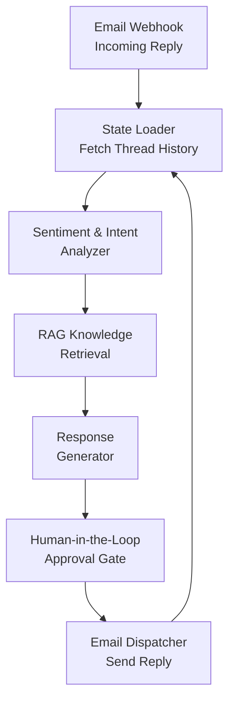

# Meeting Archive: meeting-1776172526556-npy9icb8
**Date:** April 14, 2026 at 06:47 PM

---

### user
🎧 **[Live System Audio]:**  Let us say very state-form right you have to design a real state-form. region again. That will monitor your, for example, I want to design the sales of the engine, ok. You can use langchain or whatever you want to use. You have to design it and you have to make sure you are. The email agent will do a conversation. Someone replied it will reply back to them right their job is to make sure that convincing them to buy this product. product right now you have to design it.

### user
Quick Answer

### assistant
**The Question:** Design an agentic email sales system to handle lead conversations and close product sales.

* Use LangGraph for state management to track conversation history and lead sentiment.
* Integrate a RAG pipeline for product knowledge and an Email API (SendGrid/Gmail) for I/O.
* Implement a "Human-in-the-Loop" (HITL) node for final approval before sending high-stakes sales emails.
* Should we prioritize a high-volume automated approach or a highly personalized, low-volume strategy?

### user
Full Interview Analysis

### assistant
### 1. The Interviewer's Question
"Let's say you have to design a sales engine. You can use LangChain or whatever you want to use. You have to design an email agent that handles conversations; when someone replies, it replies back to them. Their job is to convince the user to buy the product. How would you design it?"

### 2. The True Intent
The interviewer is testing the candidate's ability to design an **agentic workflow** that maintains state over an asynchronous communication channel (email). This is a **HARD PIVOT** from previous project discussions into a hypothetical system design scenario.

### 3. Technical Deep Dive
*   **State Management with LangGraph**: I would use **LangGraph** to define the conversation as a state machine. This allows the agent to track the lead's current stage in the sales funnel (e.g., "Initial Outreach," "Objection Handling," "Closing") and maintain a persistent state dictionary of the conversation history and lead sentiment.
*   **RAG Pipeline for Product Knowledge**: To ensure the agent provides accurate product details, I would implement a **RAG (Retrieval-Augmented Generation)** pipeline. This would involve storing product documentation in a vector database (similar to how I used **Pinecone** in Shadow OS) to inject relevant product specs into the prompt based on the user's specific questions.
*   **Asynchronous Event Loop**: Since email is asynchronous, the system would require a trigger-based architecture. An incoming email would trigger a webhook, which updates the LangGraph state and invokes the LLM to generate a response based on the current node in the sales graph.

### 4. Architect Follow-Ups
*   "How would you handle 'hallucinations' where the sales agent might promise a discount or feature that doesn't actually exist in the product catalog?"
*   "Since email threads can become long and messy, how would you manage the context window to ensure the agent remembers the core goal (closing the sale) without losing the nuance of the most recent reply?"

### 5. Category
[SYSTEM DESIGN]

### user
System Design

### assistant
### 1. High-Level Architecture (Spoken overview)
I'll build this as an asynchronous agentic workflow using LangGraph. Since email isn't real-time, we can't use a simple linear chain; we need a state machine that remembers where the lead is in the sales funnel. The core consists of an ingestion layer for emails, a LangGraph orchestrator to manage the conversation state and sentiment, a RAG pipeline for product facts, and a human-in-the-loop gate to ensure we don't send hallucinated promises to a customer.

### 2. End-to-End Data Flow (Conversational walkthrough)
**1. "Email Webhook"**: The process starts when a lead replies. An external API like SendGrid or Gmail triggers a webhook that pushes the raw email body and thread ID into our system.

**2. "State Loader"**: We use the thread ID to pull the existing conversation state from our database. This tells the agent if this is a first-time lead or someone we've been arguing with about pricing for three days.

**3. "Sentiment & Intent Analyzer"**: The LLM analyzes the reply. Is the lead interested, annoyed, or asking a specific technical question? This determines which node in the graph we move to next.

**4. "RAG Knowledge Retrieval"**: If the lead asks a product question, the agent queries our vector store to pull the exact specs or pricing, ensuring the response is grounded in fact and not hallucinated.

**5. "Response Generator"**: The agent drafts a reply based on the sales goal (convincing them to buy) and the retrieved context, maintaining a persuasive but professional tone.

**6. "Human-in-the-Loop Approval"**: For high-value leads or "closing" emails, the draft is paused. A human sales rep reviews it in a dashboard and hits "Send" or edits the text.

**7. "Email Dispatcher"**: Once approved or automated, the final text is sent back through the Email API to the customer.

### 3. Architecture Diagram

### 4. Database Strategy (Spoken justification)
I'd use a combination of two databases. First, a standard Postgres DB to store the "State"—this includes the thread IDs, lead contact info, and the current stage of the sales funnel. It's reliable and handles relational data well. Second, I'll use a Vector DB (like Pinecone or FAISS) for the product knowledge base. This allows the agent to perform semantic searches on product manuals and FAQs to provide accurate answers without stuffing the entire manual into the LLM prompt.

### 5. Scalability & Bottlenecks
The main bottleneck will be the LLM latency and the risk of "looping" where the agent and customer get stuck in a repetitive cycle. To scale V1, I wouldn't over-engineer with Kubernetes; a simple FastAPI app on AWS Lambda or App Runner is enough. To prevent loops, I'll implement a "max_turns" counter in the LangGraph state—if the conversation exceeds 10 emails without a conversion, it automatically flags a human to take over manually.

