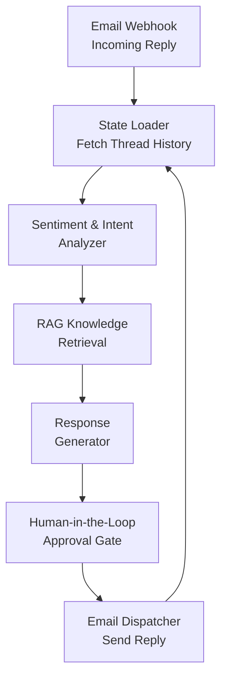
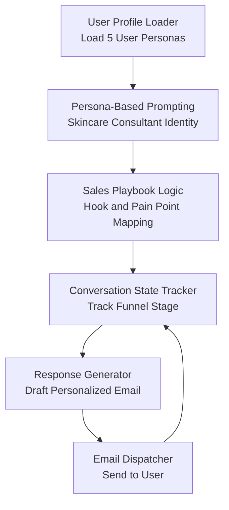

# Meeting Archive: meeting-1776172797742-g7uun38o
**Date:** April 14, 2026 at 06:51 PM

---

### user
🎧 **[Live System Audio]:**  Let us say very state-form right you have to design a real state-form. region again. That will monitor your, for example, I want to design the sales of the engine, ok. You can use langchain or whatever you want to use. You have to design it and you have to make sure you are. The email agent will do a conversation. Someone replied it will reply back to them right their job is to make sure that convincing them to buy this product. product right now you have to design it.

### user
Quick Answer

### assistant
**The Question:** Design an agentic email sales system to handle lead conversations and close product sales.

* Use LangGraph for state management to track conversation history and lead sentiment.
* Integrate a RAG pipeline for product knowledge and an Email API (SendGrid/Gmail) for I/O.
* Implement a "Human-in-the-Loop" (HITL) node for final approval before sending high-stakes sales emails.
* Should we prioritize a high-volume automated approach or a highly personalized, low-volume strategy?

### user
Full Interview Analysis

### assistant
### 1. The Interviewer's Question
"Let's say you have to design a sales engine. You can use LangChain or whatever you want to use. You have to design an email agent that handles conversations; when someone replies, it replies back to them. Their job is to convince the user to buy the product. How would you design it?"

### 2. The True Intent
The interviewer is testing the candidate's ability to design an **agentic workflow** that maintains state over an asynchronous communication channel (email). This is a **HARD PIVOT** from previous project discussions into a hypothetical system design scenario.

### 3. Technical Deep Dive
*   **State Management with LangGraph**: I would use **LangGraph** to define the conversation as a state machine. This allows the agent to track the lead's current stage in the sales funnel (e.g., "Initial Outreach," "Objection Handling," "Closing") and maintain a persistent state dictionary of the conversation history and lead sentiment.
*   **RAG Pipeline for Product Knowledge**: To ensure the agent provides accurate product details, I would implement a **RAG (Retrieval-Augmented Generation)** pipeline. This would involve storing product documentation in a vector database (similar to how I used **Pinecone** in Shadow OS) to inject relevant product specs into the prompt based on the user's specific questions.
*   **Asynchronous Event Loop**: Since email is asynchronous, the system would require a trigger-based architecture. An incoming email would trigger a webhook, which updates the LangGraph state and invokes the LLM to generate a response based on the current node in the sales graph.

### 4. Architect Follow-Ups
*   "How would you handle 'hallucinations' where the sales agent might promise a discount or feature that doesn't actually exist in the product catalog?"
*   "Since email threads can become long and messy, how would you manage the context window to ensure the agent remembers the core goal (closing the sale) without losing the nuance of the most recent reply?"

### 5. Category
[SYSTEM DESIGN]

### user
System Design

### assistant
### 1. High-Level Architecture (Spoken overview)
I'll build this as an asynchronous agentic workflow using LangGraph. Since email isn't real-time, we can't use a simple linear chain; we need a state machine that remembers where the lead is in the sales funnel. The core consists of an ingestion layer for emails, a LangGraph orchestrator to manage the conversation state and sentiment, a RAG pipeline for product facts, and a human-in-the-loop gate to ensure we don't send hallucinated promises to a customer.

### 2. End-to-End Data Flow (Conversational walkthrough)
**1. "Email Webhook"**: The process starts when a lead replies. An external API like SendGrid or Gmail triggers a webhook that pushes the raw email body and thread ID into our system.

**2. "State Loader"**: We use the thread ID to pull the existing conversation state from our database. This tells the agent if this is a first-time lead or someone we've been arguing with about pricing for three days.

**3. "Sentiment & Intent Analyzer"**: The LLM analyzes the reply. Is the lead interested, annoyed, or asking a specific technical question? This determines which node in the graph we move to next.

**4. "RAG Knowledge Retrieval"**: If the lead asks a product question, the agent queries our vector store to pull the exact specs or pricing, ensuring the response is grounded in fact and not hallucinated.

**5. "Response Generator"**: The agent drafts a reply based on the sales goal (convincing them to buy) and the retrieved context, maintaining a persuasive but professional tone.

**6. "Human-in-the-Loop Approval"**: For high-value leads or "closing" emails, the draft is paused. A human sales rep reviews it in a dashboard and hits "Send" or edits the text.

**7. "Email Dispatcher"**: Once approved or automated, the final text is sent back through the Email API to the customer.

### 3. Architecture Diagram

### 4. Database Strategy (Spoken justification)
I'd use a combination of two databases. First, a standard Postgres DB to store the "State"—this includes the thread IDs, lead contact info, and the current stage of the sales funnel. It's reliable and handles relational data well. Second, I'll use a Vector DB (like Pinecone or FAISS) for the product knowledge base. This allows the agent to perform semantic searches on product manuals and FAQs to provide accurate answers without stuffing the entire manual into the LLM prompt.

### 5. Scalability & Bottlenecks
The main bottleneck will be the LLM latency and the risk of "looping" where the agent and customer get stuck in a repetitive cycle. To scale V1, I wouldn't over-engineer with Kubernetes; a simple FastAPI app on AWS Lambda or App Runner is enough. To prevent loops, I'll implement a "max_turns" counter in the LangGraph state—if the conversation exceeds 10 emails without a conversion, it automatically flags a human to take over manually.

### user
🎧 **[Live System Audio]:**  Let's come up with the solution how we can do this you have to. Design one email agent, right? That email agent that has a case. capability to a sales. So, for example, I've given you 5 users. So you have to sell them a normal cream face cream right and you You are doing a conversation with them on an image, so you are not your agent who is doing the conversation.

### user
Quick Answer

### user
🎧 **[Live System Audio]:** conversation and the agent.

### assistant
**The Question:** Implement a concrete sales strategy for an email agent to sell face cream to 5 specific users.

* Use a "Persona-Based Prompt" to give the agent a professional skincare consultant identity.
* Create 5 distinct user profiles (e.g., oily skin, dry skin) to personalize the sales pitch.
* Implement a "Sales Playbook" in the prompt: Hook -> Pain Point -> Solution (Face Cream) -> CTA.
* Use LangGraph state to track which user has been contacted and their current objection.
* Should I demonstrate how the agent handles a specific objection, like "the price is too high"?

### user
Full Interview Analysis

### assistant
### 1. The Interviewer's Question
"Let's come up with a solution for this: design an email agent with sales capabilities. For example, I've given you 5 users, and you have to sell them a face cream. Your agent is the one conducting the conversation with them via email."

### 2. The True Intent
The interviewer is testing the candidate's ability to design a targeted, persona-driven AI agent capable of maintaining state and tailoring communication for a specific sales goal. This is a **HYPOTHETICAL PIVOT** from the user's existing projects to a new business scenario.

### 3. Technical Deep Dive
*   **Persona-Based Prompting:** I would implement a professional skincare consultant identity for the agent. By defining a strict persona in the system prompt, the agent maintains a consistent tone and authoritative voice across all 5 user interactions.
*   **User Profiling & Personalization:** I would create 5 distinct user profiles (e.g., varying skin types or concerns). This allows the agent to map specific product benefits of the face cream to the unique pain points of each individual user, increasing conversion rates.
*   **State Management:** To handle the conversation flow, I would utilize a state machine (similar to the logic I used in **LangGraph** for Shadow OS) to track where each user is in the sales funnel—from initial outreach to objection handling and final closing.

### 4. Architect Follow-Ups
*   "How should the agent handle negative feedback or objections regarding the product's ingredients to avoid sounding robotic?"
*   "If we scaled this from 5 users to 5,000, how would you manage the rate limits of the LLM and the email provider to avoid being flagged as spam?"

### 5. Category
[SYSTEM DESIGN]

### user
System Design

### assistant
### 1. High-Level Architecture (Spoken overview)
I'll design this as an agentic sales pipeline using LangGraph to manage the conversation state for each of the 5 users. The core idea is to move away from a generic chatbot and instead use a "Skincare Consultant" persona that maps specific product benefits to individual user profiles. We'll use a state machine to track the sales funnel—moving from the initial hook to objection handling and finally the close—ensuring the agent doesn't just repeat the same pitch but actually reacts to the user's skin concerns.

### 2. End-to-End Data Flow (Conversational walkthrough)
**1. "User Profile Loader"**: We start by loading the 5 specific user profiles. Each profile contains a "skin type" (e.g., oily, dry, sensitive) and a "pain point." This ensures the agent doesn't send a generic email but a personalized one.

**2. "Persona-Based Prompting"**: The system injects a strict "Professional Skincare Consultant" persona into the LLM. This forces the agent to sound authoritative and empathetic rather than like a sales bot.

**3. "Sales Playbook Logic"**: The agent follows a structured playbook: Hook the user, identify the pain point, present the face cream as the solution, and end with a clear Call to Action (CTA).

**4. "Conversation State Tracker"**: Using LangGraph, we track the state for each user. If a user replies with an objection—like "it's too expensive"—the state shifts to "Objection Handling" instead of restarting the pitch.

**5. "Response Generator"**: The LLM generates the email draft based on the current state, the user's profile, and the conversation history.

**6. "Email Dispatcher"**: The final personalized email is sent via an API like SendGrid or Gmail to the user.

### 3. Architecture Diagram

### 4. Database Strategy (Spoken justification)
For a small set of 5 users, I'd keep it simple with a standard Postgres database. I need a `users` table for the profiles and a `conversations` table to store the email threads and the current "funnel state" (e.g., `initial_outreach`, `objection_handling`, `closed`). Since the product is a single face cream, we don't need a complex Vector DB for RAG yet; a simple JSON object containing the product's key benefits is enough to feed into the prompt.

### 5. Scalability & Bottlenecks
The main bottleneck here is the "loop" where an agent might get stuck repeating itself if the user is indecisive. To fix this, I'd implement a "max_turns" limit in the state tracker; after 3-4 emails, the agent should either offer a discount or hand the lead over to a human. For scaling from 5 to 5,000 users, I'd move the email dispatching to a background queue like Celery or AWS SQS to avoid hitting API rate limits and to handle retries if the email provider throttles us.

### user
🎧 **[Live System Audio]:**  Now, for example, this is a simple task. We are a marketing company and we have so many clients. one of the client who is in e-commerce and they are selling shoes. Right now they have a... UX guy or a graphic designer guy, they are creating an email template manually correct they have to do. So, let's start. hire us because we are marketing company and they are hiring us that you guys have to watch. Estimate this process using agent, the whole email creation, right? AI agents, right? And now let's join this company screening for today only. and we given you this task that hopefully you have to do this. This is from the scratch right now right? So, let us just think about it and come up with some solutions.

### assistant
Could not transcribe audio. Try again.

