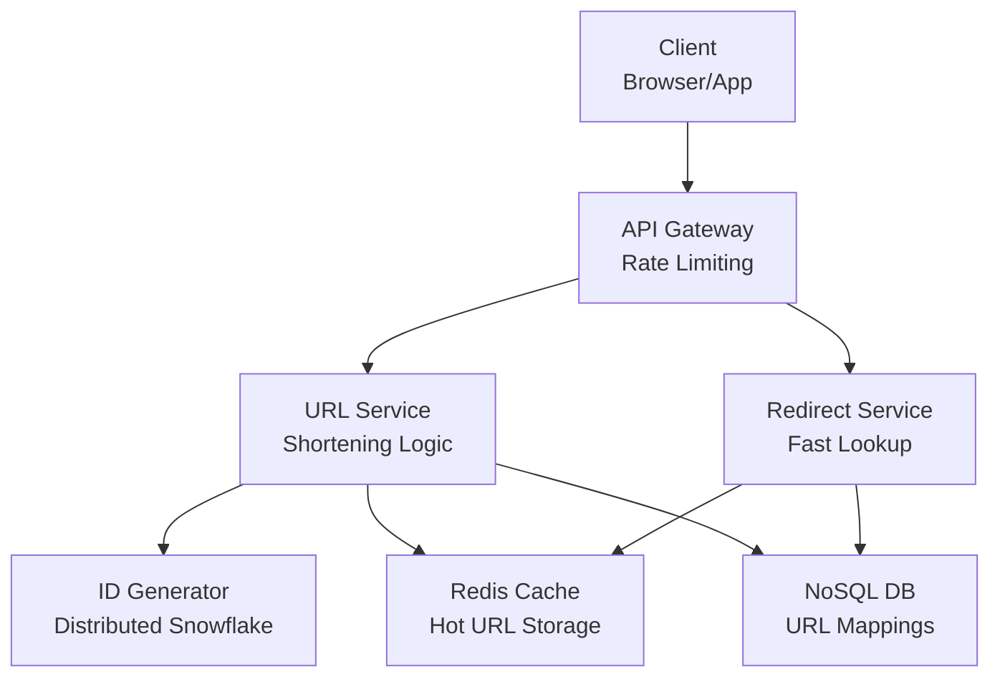

# Meeting Archive: meeting-1776703063274-deymapwm
**Date:** April 20, 2026 at 10:07 PM

---

### user
🎧 **[Live System Audio]:**  Design a URL shortener, like bitly.

### user
Quick Answer

### assistant
**The Question:** Evaluate the ability to design a scalable, high-availability system focusing on unique ID generation and read-heavy caching.
**The Spoken Hook:** I can approach this by applying the high-throughput data handling patterns I implemented in 1K Kirana.

* **API Gateway:** Manages request routing and rate limiting. **Mechanics:** Implemented via AWS API Gateway using a Base62 encoding algorithm to convert auto-incrementing IDs into short strings. **Failsafe:** Prevents DDoS attacks and brute-force URL guessing through strict throttling.
* **Persistence Layer:** Stores the mapping between short codes and original URLs. **Mechanics:** Utilizes a NoSQL database like MongoDB for O(1) lookups, paired with Redis for caching frequently accessed "hot" links. **Failsafe:** Prevents database bottlenecks during viral traffic spikes via a Cache-Aside pattern.
* **ID Generation Service:** Ensures unique, non-colliding short codes across distributed nodes. **Mechanics:** Employs a distributed counter or a Snowflake-like ID generator to avoid central lock contention. **Failsafe:** Eliminates race conditions and duplicate URL assignments in a multi-region deployment.

### user
Full Interview Analysis

### assistant
### 1. The Interviewer's Question
"Design a URL shortener, like Bitly."

### 2. The True Intent
The interviewer is testing your ability to handle a read-heavy system, specifically your knowledge of distributed unique ID generation (avoiding collisions) and caching strategies to minimize database latency.

### 3. The 60-Second Interview Script (Deep Dive)
"To design a scalable URL shortener, I’d focus on optimizing for a high read-to-write ratio. I can approach this by applying the high-throughput data handling patterns I implemented in 1K Kirana.

I would decouple the architecture by using a Base62 encoding scheme to convert a unique 64-bit integer into a short string, and store the mapping in a NoSQL database like MongoDB for O(1) lookups. To handle the massive read volume, I'd implement a Cache-Aside pattern using Redis to store the most frequently accessed 'hot' URLs.

The biggest trade-off here is the ID generation; using a single auto-incrementing database sequence creates a massive bottleneck. To mitigate the risk of a single point of failure, I would implement a distributed ID generator, like a Snowflake ID service, to ensure unique, non-colliding keys across multiple regions without requiring a central lock.

As a result, the system can achieve sub-millisecond redirection latency and horizontal scalability. If I were to extend this further, I'd invest in a real-time analytics pipeline using Kafka to track click-through rates without blocking the redirection path."

### 4. Architect Follow-Ups
1. "How would you handle the 'Thundering Herd' problem if a globally viral link expires from the Redis cache simultaneously?"
2. "If we need to support custom aliases (e.g., bit.ly/my-brand), how does that change your ID generation and collision logic?"

### 5. Category
[SYSTEM DESIGN]

### user
System Design

### assistant
### 1. Requirements
**Functional:** 
- Shorten a long URL into a unique short alias.
- Redirect a short alias back to the original long URL.
- Support custom aliases for specific users.

**Non-Functional:** 
- High Availability: Redirection must never fail.
- Low Latency: Redirection should be sub-millisecond.
- Scalability: Handle millions of writes and billions of reads.

The functional goals define our API surface, while the non-functional constraints drive our choice of caching and distributed ID generation.

### 2. Core Entities
- **URLMapping:** Maps the short code to the original long URL.
- **User:** Account details for custom aliases and rate limiting.
- **Analytics:** Click counts and metadata for each short link.

### 3. API or Interface
- `POST /v1/shorten`: Payload `{longUrl, customAlias?, userId}` $\rightarrow$ Returns `{shortUrl}`.
- `GET /{shortCode}`: Returns `302 Redirect` to the original long URL.
- `DELETE /v1/shorten/{shortCode}`: Removes the mapping.

### 4. Data Flow
**1. Request Ingestion:** The client hits the API Gateway with a long URL.
**2. ID Generation:** The system generates a unique 64-bit integer using a distributed ID generator to avoid collisions.
**3. Encoding:** This integer is converted to a Base62 string (a-z, A-Z, 0-9) to create the short code.
**4. Persistence:** The mapping is stored in the NoSQL database.
**5. Redirection:** When a user hits the short link, the system first checks Redis. If it's a cache miss, it fetches from the DB and populates the cache before redirecting the user.

### 5. High-Level Design (Architecture Diagram)

### 6. Deep Dives
**Database Strategy:** I'll use a NoSQL store like MongoDB or DynamoDB. Since we don't need complex joins and the data is a simple key-value pair, NoSQL allows for seamless horizontal scaling via sharding on the `shortCode`.

**Latency & Caching:** To satisfy the low-latency requirement, I'll implement a Cache-Aside pattern with Redis. Given that a small percentage of links (viral ones) generate the vast majority of traffic, caching the "top 20%" of links will reduce DB load by ~80%.

**Scalability & Bottlenecks:** The primary bottleneck is the ID generation. A central SQL auto-increment would crash under load. I'll use a distributed ID generator (similar to the high-throughput patterns in 1K Kirana) to ensure each node can generate unique IDs independently without a central lock, ensuring the system remains available and scalable.

### user
🎧 **[Live System Audio]:**  Design a URL shorter.

